```{r setup, include=FALSE}
knitr::opts_chunk$set(echo = TRUE)
```

<style>

.notepaper {
  position: relative;
  margin: 30px auto;
  padding: 29px 20px 20px 45px;
  width: 680px;
  line-height: 30px;
  color: #6a5f49;
  text-shadow: 0 1px 1px ;
  background-color: #f2f6c1;
  background-image: -webkit-radial-gradient(center, cover, rgba(255, 255, 255, 0.7) 0%, rgba(255, 255, 255, 0.1) 90%), -webkit-repeating-linear-gradient(top, transparent 0%, transparent 29px, rgba(239, 207, 173, 0.7) 29px, rgba(239, 207, 173, 0.7) 30px);
  background-image: -moz-radial-gradient(center, cover, rgba(255, 255, 255, 0.7) 0%, rgba(255, 255, 255, 0.1) 90%), -moz-repeating-linear-gradient(top, transparent 0%, transparent 29px, rgba(239, 207, 173, 0.7) 29px, rgba(239, 207, 173, 0.7) 30px);
  background-image: -o-radial-gradient(center, cover, rgba(255, 255, 255, 0.7) 0%, rgba(255, 255, 255, 0.1) 90%), -o-repeating-linear-gradient(top, transparent 0%, transparent 29px, rgba(239, 207, 173, 0.7) 29px, rgba(239, 207, 173, 0.7) 30px);
  border: 1px solid #c3baaa;
  border-color: rgba(195, 186, 170, 0.9);
  -webkit-box-sizing: border-box;
  -moz-box-sizing: border-box;
  box-sizing: border-box;
  -webkit-box-shadow: inset 0 1px rgba(255, 255, 255, 0.5), inset 0 0 5px #d8e071, 0 0 1px rgba(0, 0, 0, 0.1), 0 2px rgba(0, 0, 0, 0.02);
  box-shadow: inset 0 1px rgba(255, 255, 255, 0.5), inset 0 0 5px #d8e071, 0 0 1px rgba(0, 0, 0, 0.1), 0 2px rgba(0, 0, 0, 0.02);
}

.notepaper:before, .notepaper:after {
  content: '';
  position: absolute;
  top: 0;
  bottom: 0;
}

.notepaper:before {
  left: 28px;
  width: 2px;
  border: solid #efcfad;
  border-color: rgba(239, 207, 173, 0.9);
  border-width: 0 1px;
}

.notepaper:after {
  z-index: -1;
  left: 0;
  right: 0;
  background: rgba(242, 246, 193, 0.9);
  border: 1px solid rgba(170, 157, 134, 0.7);
  -webkit-transform: rotate(2deg);
  -moz-transform: rotate(2deg);
  -ms-transform: rotate(2deg);
  -o-transform: rotate(2deg);
  transform: rotate(2deg);
}

.quote {
  font-family: Georgia, serif;
  font-size: 14px;
}

.curly-quotes:before, .curly-quotes:after {
  display: inline-block;
  vertical-align: top;
  height: 30px;
  line-height: 48px;
  font-size: 50px;
  opacity: .2;
}

.curly-quotes:before {
  content: '\201C';
  margin-right: 4px;
  margin-left: -8px;
}

.curly-quotes:after {
  content: '\201D';
  margin-left: 4px;
  margin-right: -8px;
}

.quote-by {
  display: block;
  padding-right: 10px;
  text-align: right;
  font-size: 13px;
  font-style: italic;
  color: #84775c;
}

.lt-ie8 .notepaper {
  padding: 15px 25px;
}

div.footnotes {
  position: absolute;
  bottom: 0;
  margin-bottom: 70px;
  width: 80%;
  font-size: 0.6em;
}
</style>

<script src="https://ajax.googleapis.com/ajax/libs/jquery/3.1.1/jquery.min.js"></script>
<script>
$(document).ready(function() {
  $('slide:not(.backdrop):not(.title-slide)').append('<div class=\"footnotes\">');

  $('footnote').each(function(index) {
    var text  = $(this).html();
    var fnNum = (index+1).toString();
    $(this).html(fnNum.sup());

    var footnote   = fnNum + '. ' + text + '<br/>';
    var oldContent = $(this).parents('slide').children('div.footnotes').html();
    var newContent = oldContent + footnote;
    $(this).parents('slide').children('div.footnotes').html(newContent);
  });
});
</script>


## This meeting

1. In retrospect.
2. What to do with uncertainty without a truth?
3. Some reasoning when you know you're wrong.


## Disclaimer
I owe a debt of gratitude to many people as the thoughts and teachings in my slides are the process of years-long development cycles and discussions with my team, friends, colleagues and peers. When someone has contributed to the content of the slides, I have credited their authorship. 

When external figures and other sources are shown: 

1) the references are included when the origin is known, or 
2) the objects are directly linked from within the public domain and the source can be obtained by right-clicking the objects. 

Opinions are my own. 

## Terms I may use

- TDGM: True data generating model
- DGP: Data generating process, closely related to the TDGM, but with all the wacky additional uncertainty
- Truth: The comparative truth that we are interested in
- Bias: The distance to the comparative truth
- Variance: When not everything is the same
- Estimate: Something that we calculate or guess 
- Estimand: The thing we aim to estimate and guess
- Population: That larger entity without sampling variance
- Sample: The smaller thing with sampling variance
- Incomplete: There exists a more complete version, but we don't have it
- Observed: What we have
- Unobserved: What we would also like to have

# In retrospect

## At the start

We began this course series with a lecture on statistical inference. 

<div class="notepaper">
  <figure class="quote">
    <blockquote class="curly-quotes" cite="https://www.youtube.com/watch?v=qYLrc9hy0t0">
    <font color="black">
    Statistical inference is the process of drawing conclusions from truths
    </font>
    </blockquote>
  </figure>
</div>

Truths are boring, but they are convenient. 

- however, for most problems truths require a lot of calculations, tallying or a complete census. 
- therefore, a proxy of the truth is in most cases sufficient 
- An example for such a proxy is a **sample**
- Samples are widely used and have been for a long time<footnote>See [Jelke Bethlehem's CBS discussion paper](https://www.google.com/url?sa=t&rct=j&q=&esrc=s&source=web&cd=&ved=2ahUKEwjkyPTCs4L3AhUCuKQKHUpmBvIQFnoECAMQAw&url=https%3A%2F%2Fwww.cbs.nl%2F-%2Fmedia%2Fimported%2Fdocuments%2F2009%2F07%2F2009-15-x10-pub.pdf&usg=AOvVaw3BpUW2s_k0MB5yH1o-QGf2) for an overview of the history of sampling within survey statistics</footnote>

## Being wrong about the truth
<div style="float: left; width: 40%;">
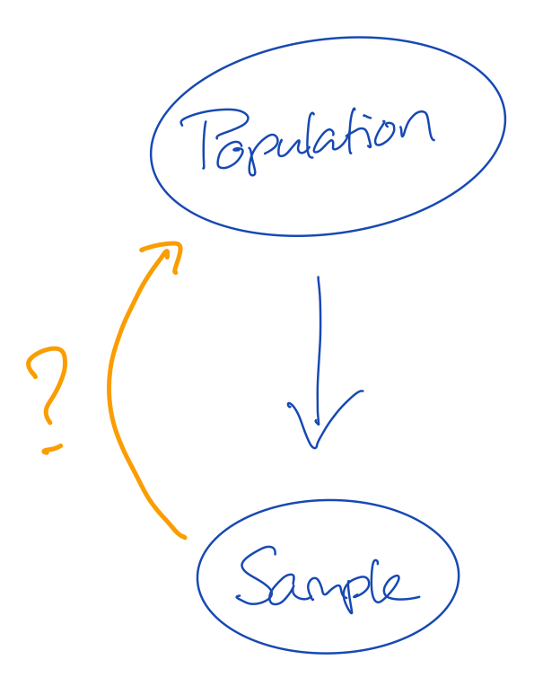{width=90%}
</div>

<div style="float: right; width: 60%;">
- The population is the truth
- The sample comes from the population, but is generally smaller in size
- This means that not all cases from the population can be in our sample
- If not all information from the population is in the sample, then our sample may be *wrong*
<br><br><br>
Q1: Why is it important that our sample is not wrong?<br>
Q2: How do we know that our sample is not wrong?

</div>

<div style="clear: both;"></div>


## Solving the missingness problem
<div style="float: left; width: 40%;">
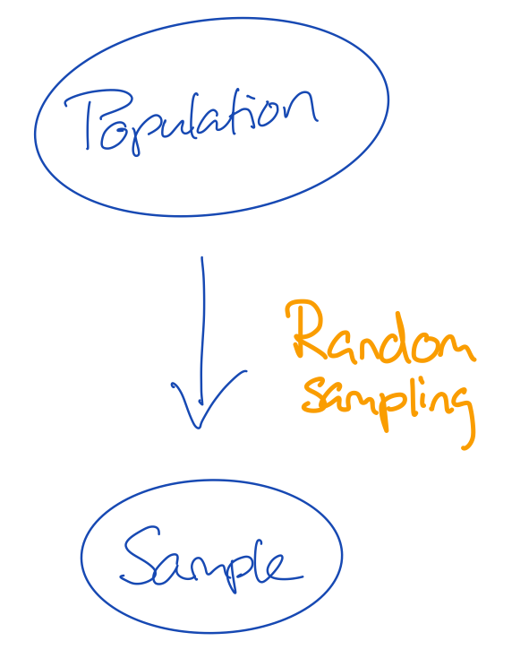{width=90%}
</div>

<div style="float: right; width: 60%;">
- There are many flavours of sampling
- If we give every unit in the population the same probability to be sampled, we do **random sampling**
- The convenience with random sampling is that the missingness problem can be ignored
- The missingness problem would in this case be: **not every unit in the population has been observed in the sample**

<br><br><br>
Q3: Would that mean that if we simply observe every potential unit, we would be unbiased about the truth?

</div>

<div style="clear: both;"></div>

## Sidestep
<div style="float: left; width: 50%;">
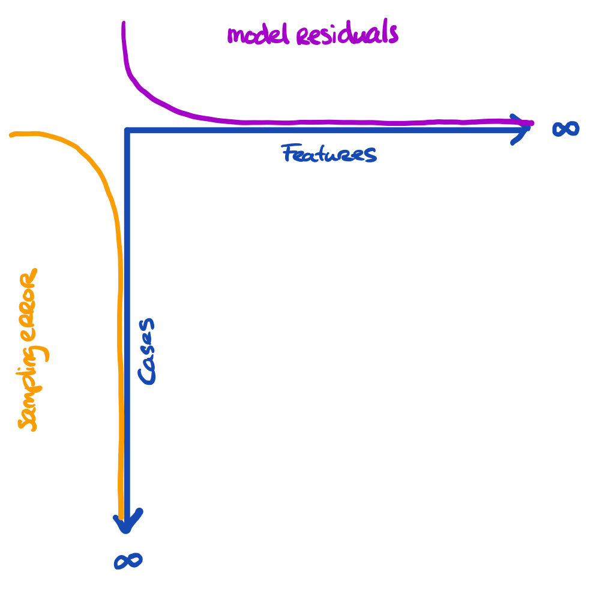{width=90%}
</div>

<div style="float: right; width: 50%;">
- The problem is a bit larger
- We have three entities at play, here:

  1. The truth we're interested in
  2. The proxy that we have (e.g. sample)
  3. The model that we're running
  
- The more features we use, the more we capture about the outcome for the cases in the data
- The more cases we have, the more we approach the true information
<br><br><br>
All these things are related to uncertainty. Our model can still yield biased results when fitted to $\infty$ features. Our inference can still be wrong when obtained on $\infty$ cases. 
</div>

<div style="clear: both;"></div>

## Sidestep
<div style="float: left; width: 50%;">
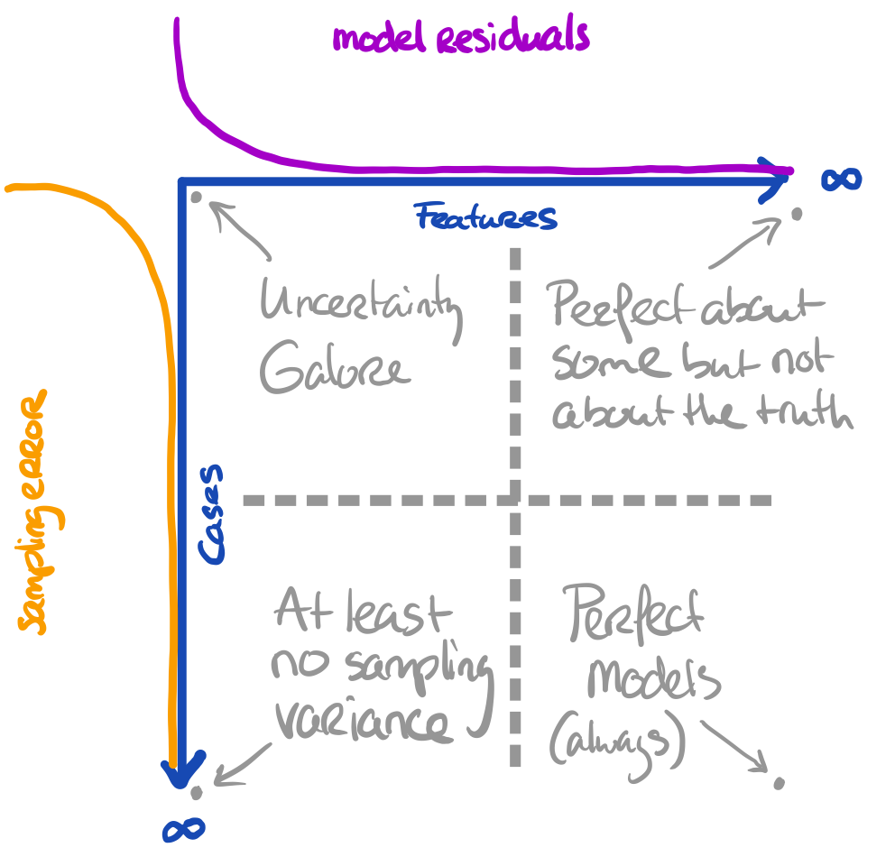{width=90%}
</div>

<div style="float: right; width: 50%;">
- The problem is a bit larger
- We have three entities at play, here:

  1. The truth we're interested in
  2. The proxy that we have (e.g. sample)
  3. The model that we're running
  
- The more features we use, the more we capture about the outcome for the cases in the data
- The more cases we have, the more we approach the true information
<br><br><br>

**Core assumption: all observations are bonafide**
</div>

<div style="clear: both;"></div>

## Uncertainty simplified
<div style="float: left; width: 70%;">
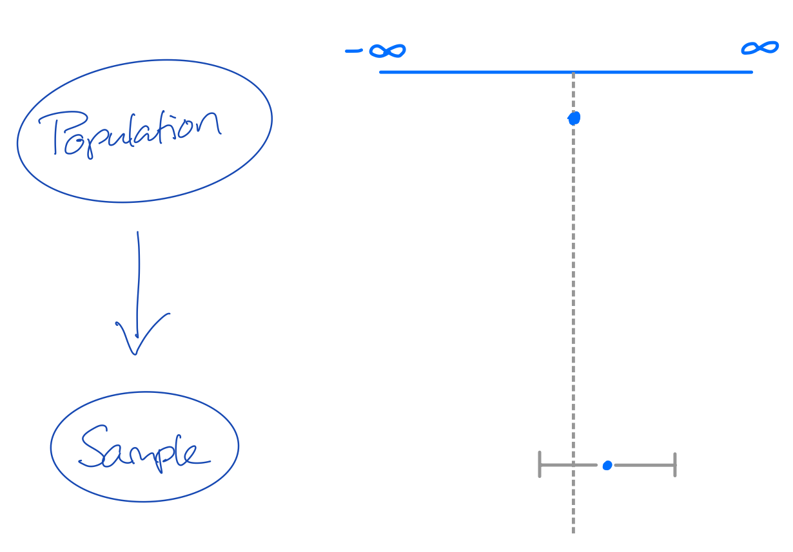{width=90%}
</div>

<div style="float: right; width: 30%;">
When we do not have all information ...

1. We need to accept that we are probably wrong
2. We just have to quantify how wrong we are

<br>
In some cases we estimate that we are only a bit wrong. In other cases we estimate that we could be very wrong. This is the purpose of testing. 
<br><br>
The uncertainty measures about our estimates can be used to create intervals
</div>

<div style="clear: both;"></div>

## Confidence intervals
<div style="float: left; width: 70%;">
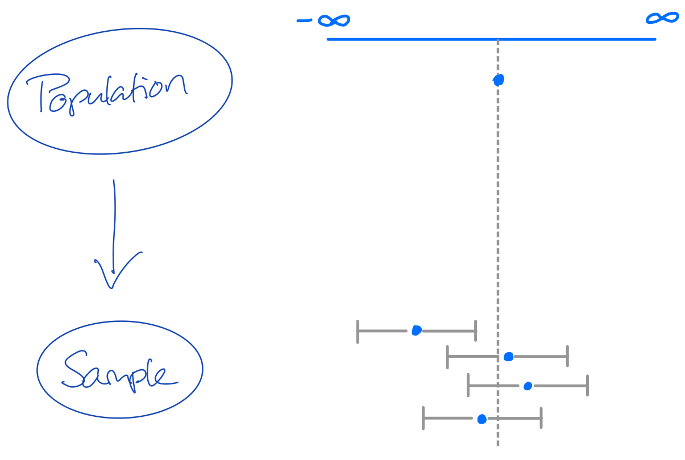{width=90%}
</div>

<div style="float: right; width: 30%;">
Confidence intervals can be hugely informative!

If we sample 100 samples from a population, then a *95% CI* will cover the population value at least 95 out of 100 times. 

- If the coverage <95: bad estimation process with risk of errors and invalid inference
- If the coverage >95: inefficient estimation process, but correct conclusions and valid inference. Lower statistical power. 
</div>

<div style="clear: both;"></div>

## The other type of intervals
<div style="float: left; width: 60%;">
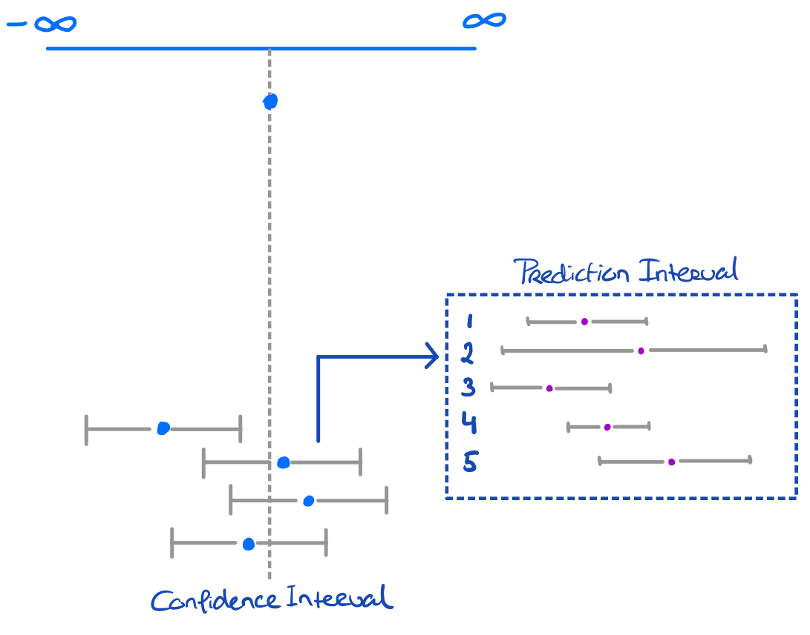{width=90%}
</div>

<div style="float: right; width: 40%;">
Prediction intervals can also be hugely informative!

Prediction intervals are generally wider than confidence intervals

- This is because it covers inherent uncertainty in the data point on top of sampling uncertainty
- Just like CIs, PIs will become more narrow (for locations) where more information is observed (less uncertainty)
- Usually this is at the location of the mean of the predicted values.

<br>
**Narrower intervals mean less uncertainty. It does not mean less bias!**

</div>

<div style="clear: both;"></div>

## The holy trinity
Whenever I evaluate something, I tend to look at three things:

- bias (how far from the truth)
- uncertainty/variance (how wide is my interval)
- coverage (how often do I cover the truth with my interval)

<br>
As a function of model complexity in specific modeling efforts, these components play a role in the bias/variance tradeoff

<center>
{width=40%}
</center>

## Now with missingness
<div style="float: left; width: 30%;">
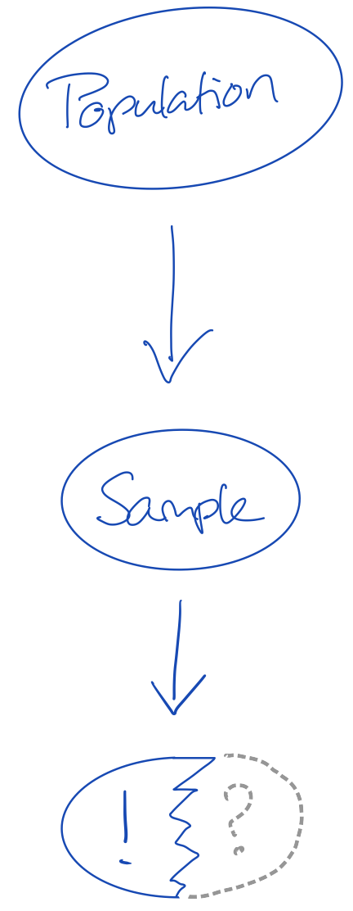{width=60%}
</div>

<div style="float: right; width: 70%;">
We now have a new problem:

- we do not have the whole truth; but merely a sample of the truth
- we do not even have the whole sample, but merely a sample of the sample of the truth. 

Q4. What would be a simple solution to allowing for valid inferences on the incomplete sample? <br>
Q5. Would that solution work in practice?
</div>

<div style="clear: both;"></div>

## Now with missingness
<div style="float: left; width: 30%;">
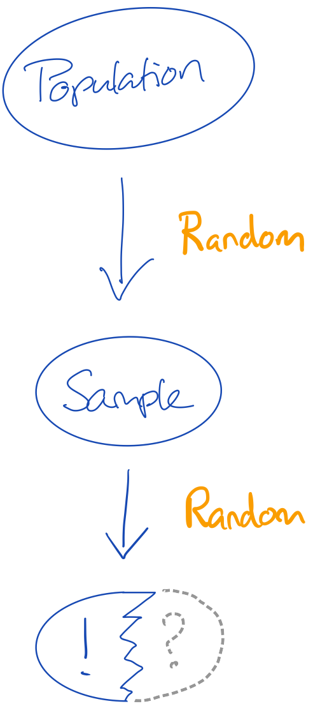{width=68%}
</div>

<div style="float: right; width: 70%;">
We now have a new problem:

- we do not have the whole truth; but merely a sample of the truth
- we do not even have the whole sample, but merely a sample of the sample of the truth. 

Q4. What would be a simple solution to allowing for valid inferences on the incomplete sample? <br>
Q5. Would that solution work in practice?
</div>

<div style="clear: both;"></div>

## Multiple imputation
<div style="float: left; width: 60%;">
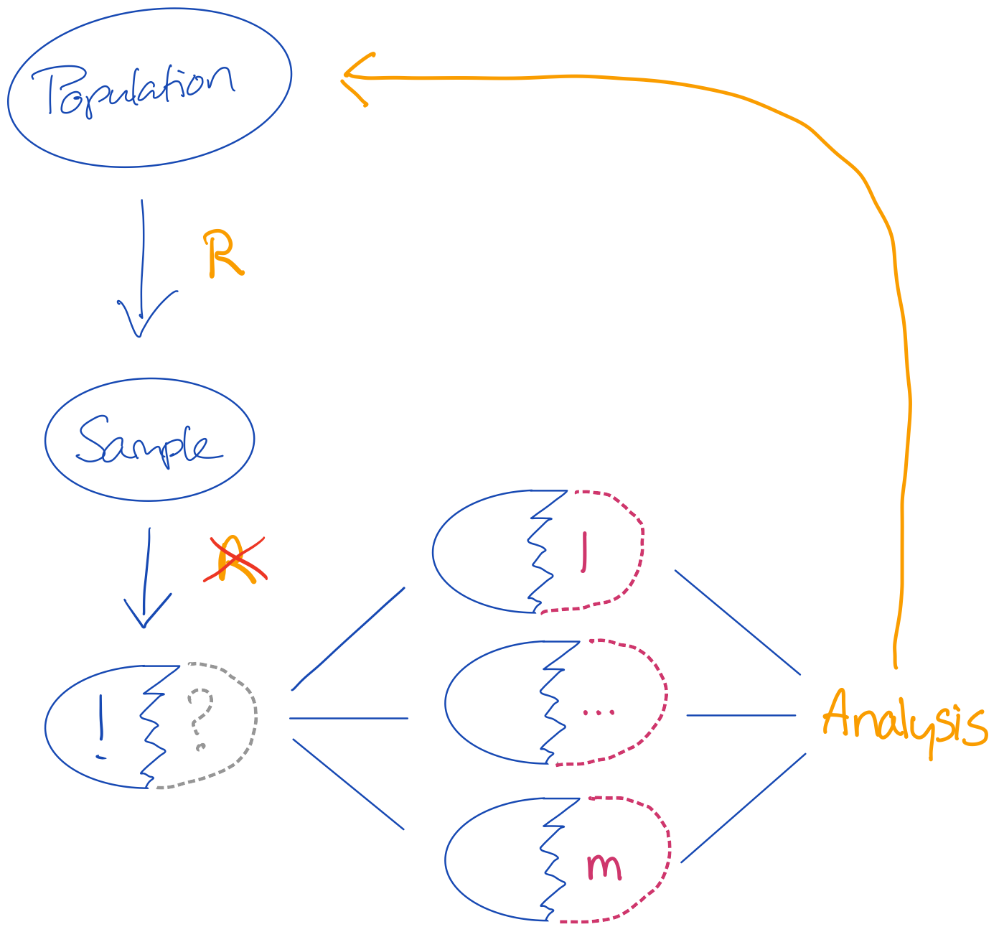{width=80%}
</div>

<div style="float: right; width: 40%;">
There are two sources of uncertainty that we need to cover:

1. **Uncertainty about the missing value**:<br>when we don't know what the true observed value should be, we must create a distribution of values with proper variance (uncertainty).
2. **Uncertainty about the sampling**:<br>nothing can guarantee that our sample is the one true sample. So it is reasonable to assume that the paramaters obtained on our sample are biased. 

<br>
**More challenging if the sample does not randomly come from the population or if the feature set is too limited to solve for the substantive model of interest**

<div style="clear: both;"></div>

## Now how do we know we did well?
I'm really sorry, but:
<div class="notepaper">
  <figure class="quote">
    <blockquote class="curly-quotes" cite="https://www.youtube.com/watch?v=qYLrc9hy0t0">
    <font color="black">
    We don't. In practice we may often lack the necessary comparative truths!
    </font>
    </blockquote>
  </figure>
</div>

For example:

1. Predict a future response, but we only have the past
2. Analyzing incomplete data without a reference about the truth
3. Estimate the effect between two things that can never occur together
4. Mixing bonafide observations with bonafide non-observations

# What to do with uncertainty without a truth?

## Scenario 
Let's assume that we have an incomplete data set and that we can impute the incomplete values under multiple models

**Challenge**<br>
Imputing this data set under one model may yield different results than imputing this data set under another model. 

**Problem**<br>
We have no idea about validity of either model's results: we would need either the true observed values or the estimand before we can judge the performance and validity of the imputation model.

<div class="notepaper">
  <figure class="quote">
    <blockquote class="curly-quotes" cite="https://www.youtube.com/watch?v=qYLrc9hy0t0">
    <font color="black">
    We do have a constant in our problem, though: **the observed values**
    </font>
    </blockquote>
  </figure>
</div>

## Solution

<div style="float: left; width: 50%;">
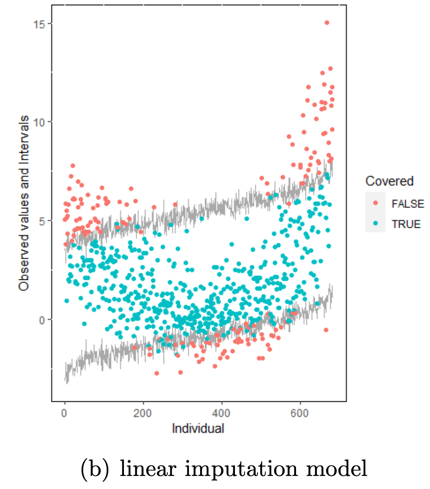{width=80%}
</div>

<div style="float: right; width: 50%;">
We can *overimpute* the observed values and evaluate how well the models fit on the observed values. 

The assumption would then be that any good imputation model would properly cover the observed data (i.e. would fit to the observed data). 

- If we overimpute the observations multiple times we can calculate bias, intervals and coverage. 
- The model that would be unbiased, properly covered and have the smallest interval width would then be the most efficient model. 

The model to the left clearly does not fit well to the observations.
</div>

<div style="clear: both;"></div>

## Solution

<div style="float: left; width: 50%;">
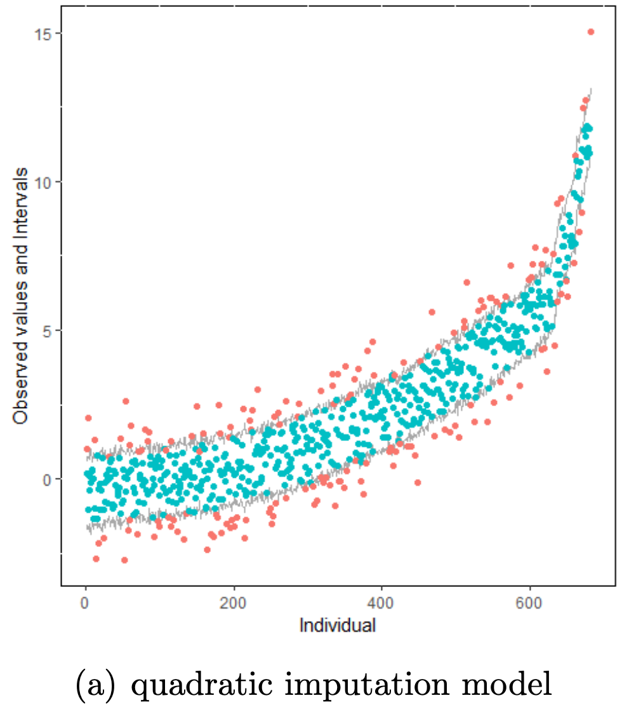{width=80%}
</div>

<div style="float: right; width: 50%;">
We can *overimpute* the observed values and evaluate how well the models fit on the observed values. 

The assumption would then be that any good imputation model would properly cover the observed data (i.e. would fit to the observed data). 

- If we overimpute the observations multiple times we can calculate bias, intervals and coverage. 
- The model that would be unbiased, properly covered and have the smallest interval width would then be the most efficient model. 

The model to the left fits quite well to the observations.

<br> Q6. Can we infer truth?
</div>

<div style="clear: both;"></div>

# When you know you're wrong

## Scenario

In a survey about research integrity and fraud we surveyed behaviours and practices in the following format. 

<center>
{width=60%}
</center>
<br>
Many behaviours were surveyed over multiple groups of people. Some findings:

- In most groups similar behavioural prevalence was observed. 
- When looking at subgroups, prevalences differ between subgroups.
- Not applicables were much more prevalent in one group than in other groups
- There are too few cases and too many patterns with `Not Applicable`'s over features to allow for a pattern-wise analysis (stratified analysis).
- There are too many `Not Applicables` to allow for *listwise deletion*.

We know: 

1. `Not Applicable` is not randomly distributed over the data. Removing them is not valid
2. `Not Applicable` are bonafide missing values: there should be no observations.

## Now what?
There is no solution to this problem

1. Imputing `Not Applicable` values will have an effect on the inference
2. Not imputing `Not Applicable` leaves us with no inference
3. Ignoring `Not Applicable` leaves us with an unknown effect; we know from missing data theory that it will bias results and lead to invalid inference. 

**Our solution**
We chose to impute the data as `1 (never)`. There are a couple of reasons why we think that this is the best defendable scenario.

1. `Never` has a semantic similarity to a behaviour not being applicable. However, `Never` implies intentionality; `Not Applicable` does not.
2. We know the effect the imputation has on the inference: Filling in `Never` will underestimate intentional behaviours. 

In this case the choice was made to make a **deliberate error**. The estimates obtained would serve as an underestimation of *true behaviour* and can be regarded as the lower bound. 

This is a conservative approach; this study was aimed at identifying fraud - labeling non-fraudulent behaviour as fraudulent was deemed the more costly error.

## Next up

This meeting is also the time to pick our brains. So we've asked you to

1. Create a short presentation about a practical or conceptual scenario in your work (i.e. one or two slides).
2. This scenario may be data-based, information-based, problem-based, etcetera.
3. The scenario may be real, data-based, simulated or even hypothetical, but you must be able to describe it.

