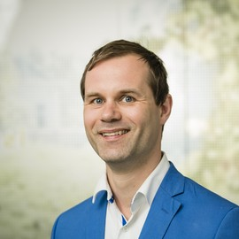
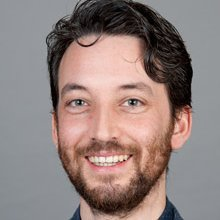
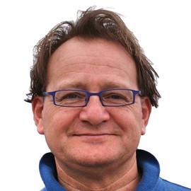

# Intro {.sidebar}

This dashboard covers the course materials for the statistics course meetings between Utrecht University and the Rabobank. 
   

---

---

Course coordinator: [dr. Gerko Vink](https://www.gerkovink.com)  
Lecturers:  
- [dr. Peter Lugtig](https://www.peterlugtig.com)  
- [prof.dr. Peter van der Heijden](https://www.uu.nl/medewerkers/pgmvanderheijden)  
- [prof.dr. Stef van Buuren](https://stefvanbuuren.name)  
- [prof.dr. Daniel Oberski](https://daob.nl/)  
- [dr. Rebecca Kuiper](https://www.uu.nl/medewerkers/rmkuiper)  

---

We will adapt the course as we go. Therefore we suggest to access the materials online when we consider them. 

---

**Schedule**  

| # | Time         | Date        |
|---|--------------|-------------|
| 1 | 9.30 - 12.00 | January 21  |
| 2 | 9.30 - 12.00 | February 11 |
| 3 | 9.30 - 12.00 | March 11    |
| 4 | 9.30 - 12.00 | March 25    |
| 5 | 9.30 - 12.00 | April 8     |

# Meet the team

## Column 1

### dr. Peter Lugtig

{width=80%}

Peter Lugtig is an associate professor at the department of Methodology and Statistics at Utrecht University, where he specializes in survey methodology, which includes inferences using a mix of survey data and big data and the modelling of survey errors, and the use of sensor technology in smartphones.

### prof. dr. Peter van der Heijden

{width=80%}

Peter van der Heijden has a chair in statistics for the behavioural and social sciences.
His research concerns linkage of registers, population size estimation, randomized response, estimating fraud, and models for the analysis of categorical data. For a variety of Dutch ministries he has carried out contract research in these areas.

### prof.dr. Daniel Oberski

{width=80%}

Daniel Oberski is full professor of health and social data science, with a joint appointment at Utrecht University’s Department of Methodology & Statistics, and the department of Biostatistics and Data Science at the Julius Center, University Medical Center Utrecht (UMCU). His research focuses on data science methodology, in particular the problem of measurement in the social and health sciences. 

## Column 2 

### prof.dr. Stef van Buuren

{width=80%}

Stef van Buuren is Professor of Statistical Analysis of Incomplete Data at the University of Utrecht and Principal Scientist at the Netherlands Organisation for Applied Scientific Research TNO in Leiden. His interests include the analysis of incomplete data, child growth and development, computational statistics, measurement and individual causal effects.

### dr. Rebecca Kuiper

{width=83%}

Rebecca Kuiper is an assistant professor at the Department of Methods and Statistics at University Utrecht. I am passionate about doing research in the field of (bio)statistics & psychometrics and behavioural & social sciences

### dr. Gerko Vink

{width=80%}

Gerko Vink is a statistician masquerading as a data scientist with a passion for educating people. He has an interest in new developments concerning the presentation of data, results and knowledge. His work focuses on problems where not all data is available (some left in the dark), privacy, computational evaluation and programming. He works as an associate professor at Utrecht University

# Meeting 1

## Column 1

### This meeting
In this meeting, [dr. Peter Lugtig](https://www.peterlugtig.com)
will teach us about *Inference and Hypothesis Testing*.  

During and after the lecture there will be plenty of room for questions and discussion. To aid the understanding of this meeting's theory we have prepared a series of exercises for you. You can find all meeting materials in the column to the right. 

### Meeting schedule
| When?  |      | What?      |
|:--------|:-------|:-------------|
| 09.30 | 09.45  | Introduction |
| 09.45 | 11.15  | Lecture |
| 11.15 | 11.30  | Discussion |
| 11.30 | 12.00  | Set up for next meeting |

We will reserve plenty of room for breaks. 

### Other useful links
Please find here any useful links relating to this meeting's materials

## Column 2

### Lecture slides
Please find the lecture slides and relevant materials below:

- Slides on [Inference and Hypothesis testing]()

### Exercises in JASP
[JASP](https://jasp-stats.org) is an open-source statistics processor aimed at provinding an easy to use intuitive interface for standard analysis procedures. If you have little experience with statistics and programming, we recommend following the exercises in JASP. 

- [JASP exercises for meeting 1]()

If you have questions about the exercises, please contact [Gerko Vink](mailto::G.Vink@uu.nl)

### Exercises in `R`
[`R`](https://www.r-project.org) is a free software environment that serves as the de facto standard for statistical computing and graphics. If you have experience with statistics and programming, we recommend following the exercises in `R`. 

- [R exercises for meeting 1]()

If you have questions about the exercises, please contact [Gerko Vink](mailto::G.Vink@uu.nl)

**Other useful links for the `R` exercises: **

- For those that are not yet familiar with `R`, Gerko Vink has developed [this course including video walkthroughs](https://www.gerkovink.com/prepR/#exercises) aimed at getting participants jump-started with scripting in `R`. 
- [The tidyverse style guide](https://style.tidyverse.org)

