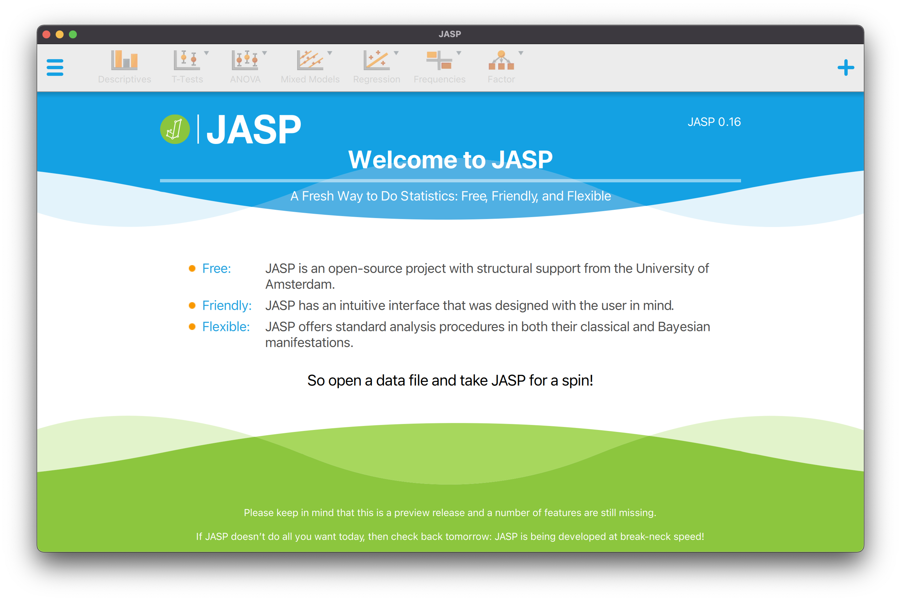
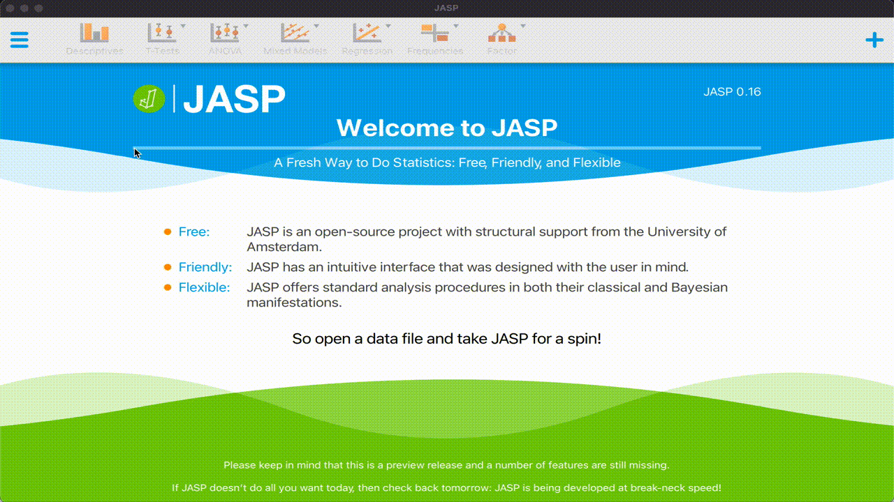
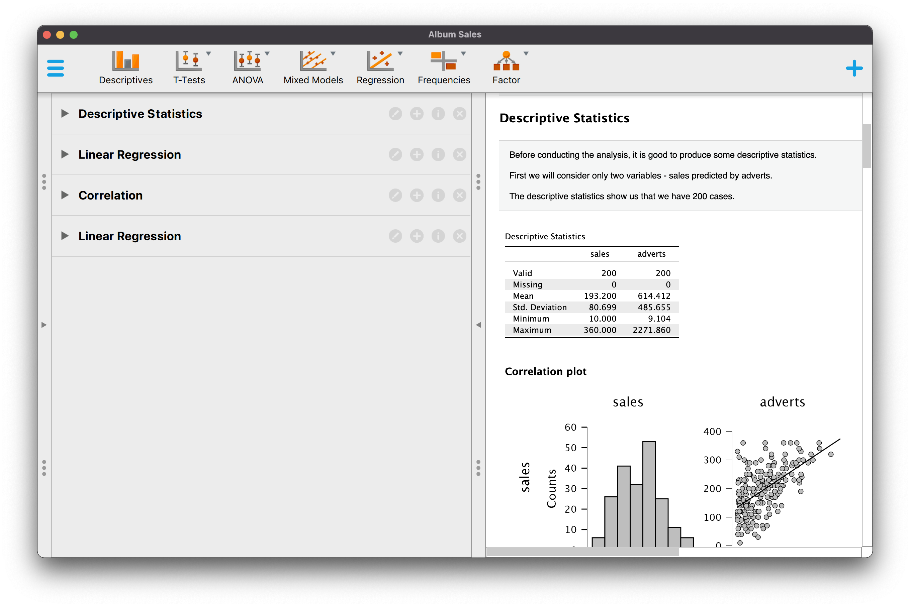
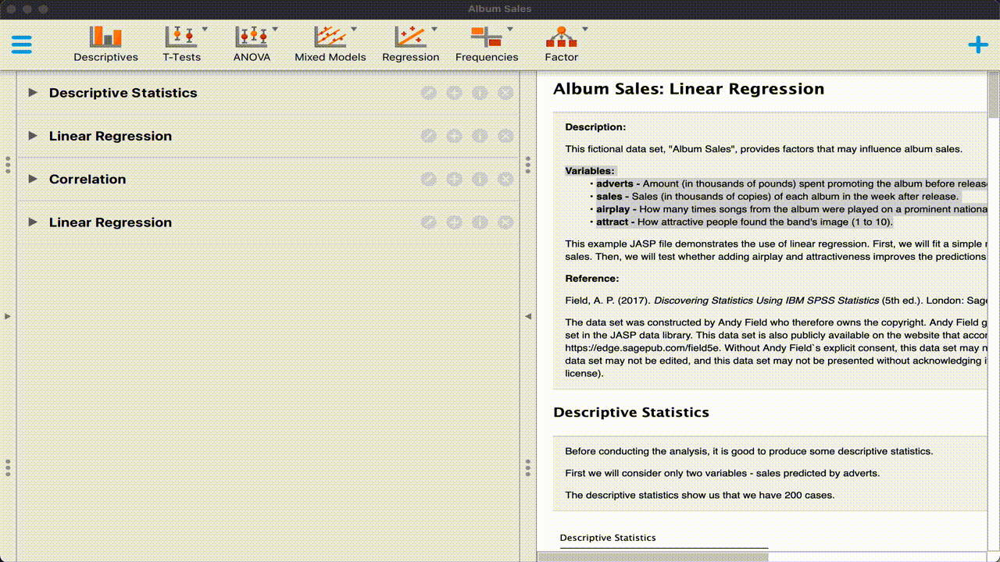

  

---

In this first `JASP` exercise, we will get to know the `JASP` environment. We will also focus on importing our own data in the `JASP` processor. If you have any questions about this exercise, [please contact me](mailto:G.Vink@uu.nl). 

Let's get started. 

-Gerko Vink

---

# Introduction

JASP is an open-source statistics processor developed in Amsterdam with contributions from a great number of statistical experts. It is aimed at giving a no-nonsense and valid approach to statistical analysis and integrates well into the workflows of social scientists and the open science community. 

I can highly recommend that you watch the following video to get a good overview of JASP

<iframe width="560" height="315" src="https://www.youtube-nocookie.com/embed/HxqB7CUA-XI" title="YouTube video player" frameborder="0" allow="accelerometer; autoplay; clipboard-write; encrypted-media; gyroscope; picture-in-picture" allowfullscreen></iframe>

JASP is supported by a wonderful community. There are [tons of YouTube videos](https://www.youtube.com/c/JASPStatistics/featured) and a well-designed [website](https://jasp-stats.org) which efficiently channels the [means of Support](https://jasp-stats.org/support/) that users can get from the developers and the community.

---

# Frequentist inference
Frequentist inference is the process of drawing conclusions from information wherein the emphasis lies on the frequency or proportion of findings in the data. The well-known and widely adopted methodological frameworks of hypothesis testing and confidence intervals are founded in this frequentist type of inference. Almost all statistical software allows for frequentist inference. 

---

# Bayesian inference
JASP also allows for Bayesian inference: this type of inference uses Bayes' theorem to update the probability for a hypothesis as more evidence or information becomes available. Bayesian inference is often considered to have advantages over the standard framework of frequentist null-hypothesis significance testing. For example, it can be used to obtain evidence in favor of the null hypothesis and it can discriminate between the *absense of evidence* and *evidence of absence*. For now, we'll focus on frequentist methods, but later on in the course we will come in contact with Bayesian methods. 

If you'd like to know more about Bayesian analysis in the context of JASP, [this manuscript](https://link.springer.com/article/10.3758/s13423-020-01798-5) serves as a good starting point for adopting a Bayesian analysis workflow. 

---

# JASP on your machine
JASP can be [downloaded](https://jasp-stats.org/download/) for Windows, Mac and Linux/Chromebook. The software is free and open source. 

---

## Installing JASP
Installing JASP on any platform is straightforward:

1. Download [the corresponding platform installer](https://jasp-stats.org/download/)
2. Install the software

For Windows systems where the software installer fails, a [pre-installed version is available](https://jasp-stats.org/thank-you-for-downloading-jasp-win64-zip/)

---

## JASP online
An [online implementation of JASP](https://www.rollapp.com/app/jasp) has been deployed by app-platform [rollApp](https://www.rollapp.com). This implementation is not affiliated with JASP and requires a monthly premium scubscription, because running JASP in the browser requires resources that do not fall in the free [rollApp](https://www.rollapp.com) tier. 

---

# The user interface
When you open JASP, the following window appears:

{width=100%}

In this window, no data is present and a *Welcome to JASP* background is shown. 

The top menu bar allows for all navigation and the selection of statistical methods and procedures. 
  

{width=100%}

  
When you click the hamburger symbol you can open a data set. 
  

{width=90%}

---

# Navigating the interface panes

__1__ **Open the data set `Album Sales` in the `Regression` folder in the JASP `Data Library`.**
  
{width=90%}
  

The `Album Sales` data set contains infromation on 4 variables:

- `adverts`: Amount (in thousands of pounds) spent promoting the album before release.
- `sales`: Sales (in thousands of copies) of each album in the week after release.
- `airplay`: How many times songs from the album were played on a prominent national radio station in the week before release.
- `attract`: How attractive people found the band's image (1 to 10).

The interface shows two panes:

{width=100%}

The left pane displays some default analyses that have been run on this data set. The right pane displays the output of these analyses. These analyses serve instructional purposes and have been chosen and annotated with explanatory text by the developers for this built-in data set. The analyses run are:

- Descriptive statistics for the columns `sales` and `advert` that show some quick univariate distributional statistics about the columns in the data, such as the number of cases, the number of missings, means, standard deviations and the minimum and maximum values. 
- Linear regression analysis with the outcome `sales` modeled based on predictor `advert`. 
- Pearson's correlation coefficient to study (in this case the one-sided positive) association between all columns in the data.
- Another linear model where outcome `sales` is predicted by all other columns in the data. 

__2__ **Study the data set values**

JASP offers a capable spreadsheet-like data pane for convenient data editing and viewing. You can open this pane by *clicking* the grey triangle in the left margin. 
  
{width=90%}
  

Double-clicking a cell would open the data editor. In the data editor, data records can be changed, added and deleted. 

---

# Changing the interface language
If you'd prefer another language than English, you can change the JASP user interface language under `Preferences > Interfaces`
  

{width=90%}

---

End of **Introduction to JASP**