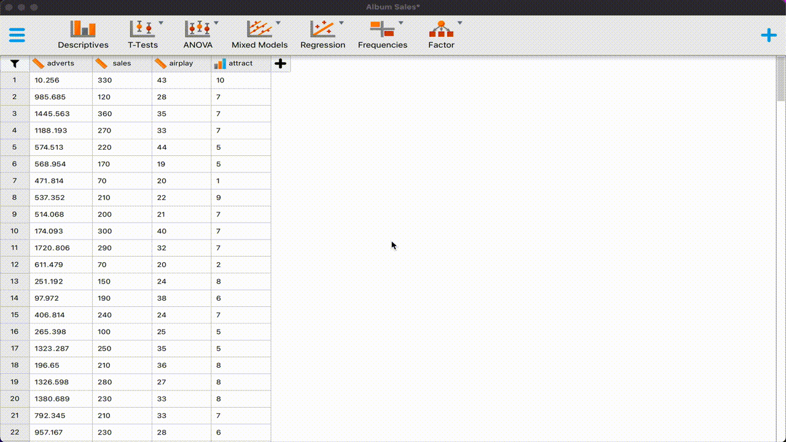
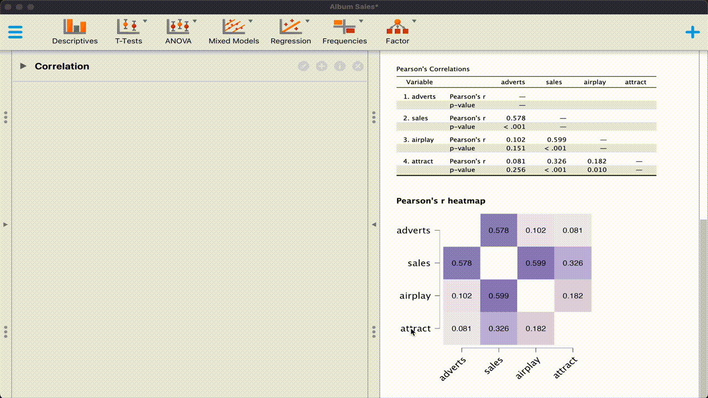
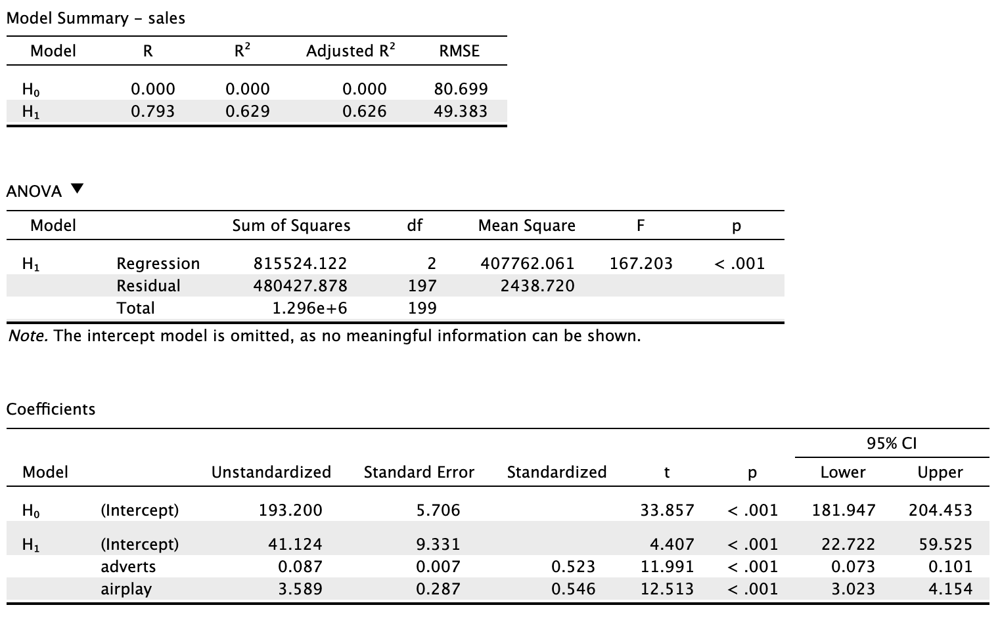
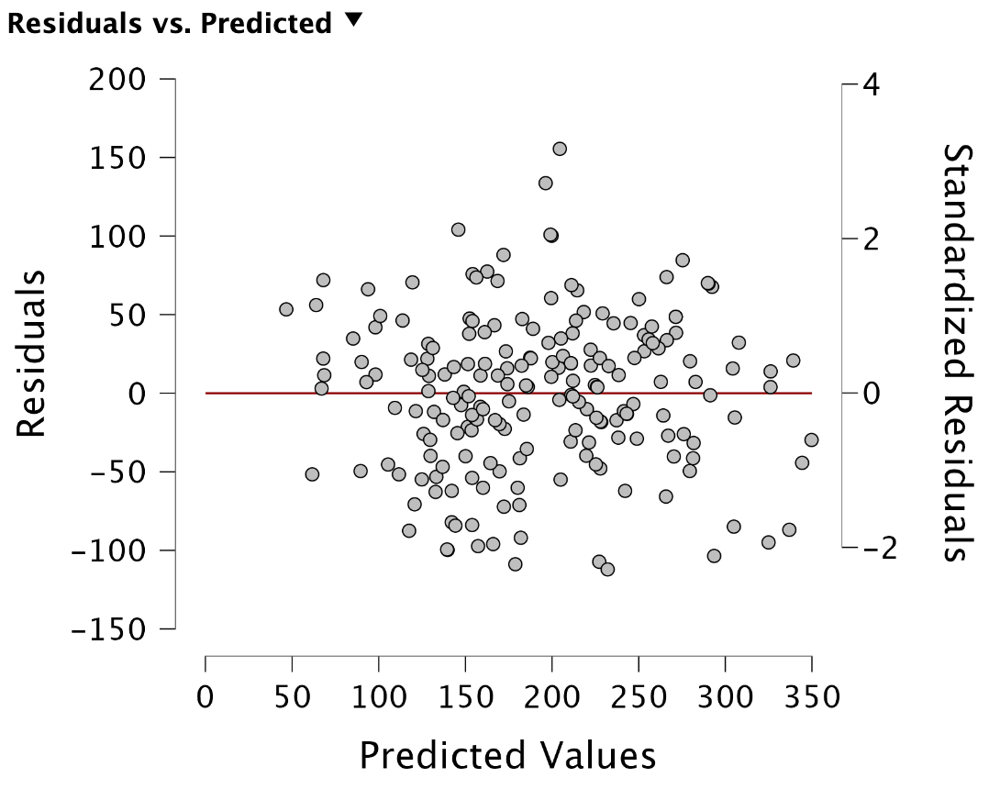
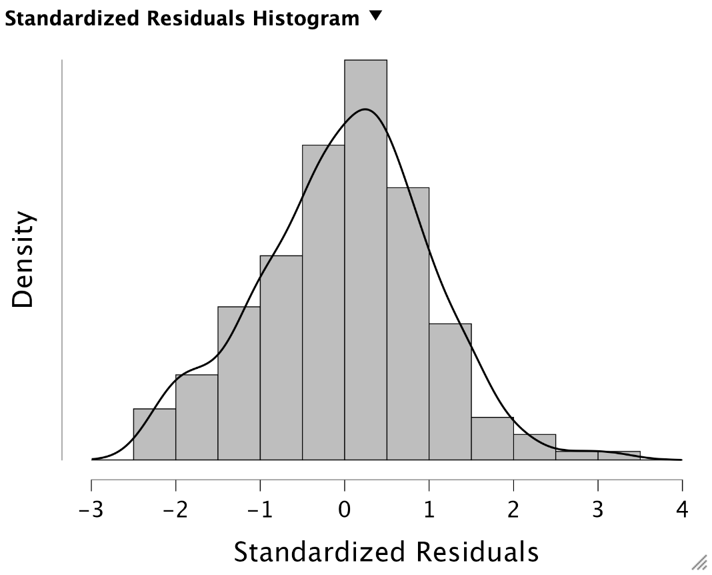
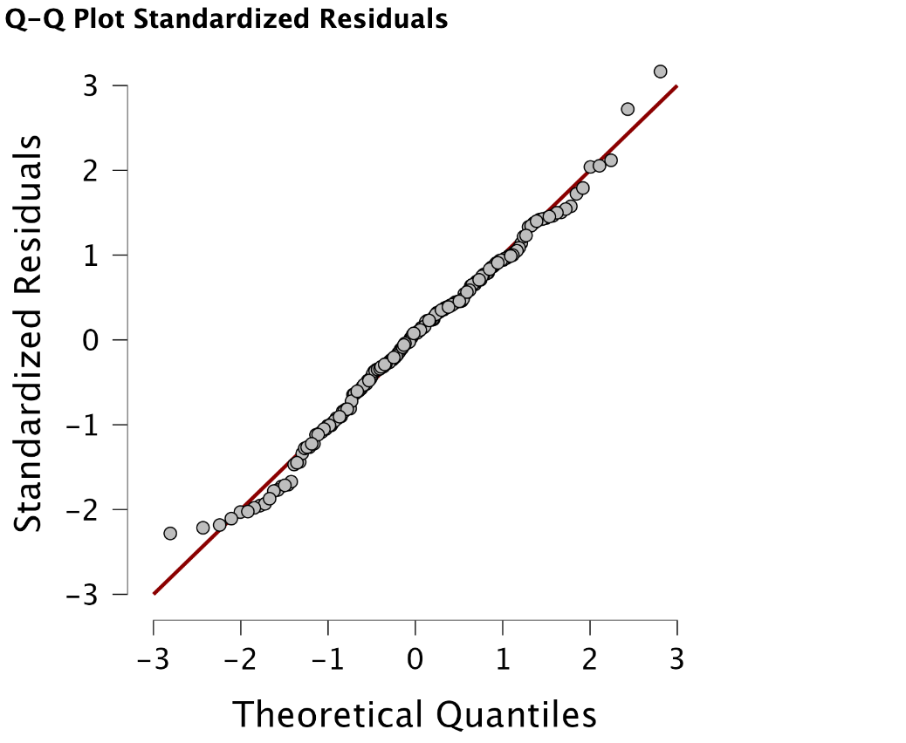

  

---

In this `JASP` exercise, we will get to know the `JASP` regression procedure. If you have any questions about this exercise, [please contact me](mailto:G.Vink@uu.nl). 

Let's get started. 

-Gerko Vink

---

# The `Album Sales` data

## Exercise 1
__1__ Open the `Album Sales` data set and remove the executed analyses.
  

  

---

# Exploring correlations

## Exercise 2
__2__ Study the Pearson's correlations between the columns in the data. Ask for `report significance` and `plot heatmap`. 
  

  

We can see that some of the correlations are quite substantial. For example, the correlations between `adverts` and `sales` and `sales` and `airplay` are almost $\rho = .6$. These correlations are also significant. The significance test for correlations tests whether the observed value for the statistic differs from a correlation of $\rho = 0$. The null-hypothesis would be that there is no correlation between two columns, which is equivalent to a correlation of $\rho = 0$. 

Studying the correlations is often a good idea to get some feeling with the *flow of information* in a data set. For example, certain clusters of variables may be more related than other clusters. This is important to be aware of, because of this relation is too high, the columns in the data may be multicollinear. 

## Multicollinearity

Multicollinearity means that two or more predictors in a multiple regression model (i.e. a model with one continuous outcome and more than one predictor) are strongly correlated. If the correlation between two or more regressors is perfect, we speak of supercollinearity. This happens with copies of columns or with compositional data where more than one column would sum up to another column. The columns in the data are then linearly dependent. 

With multicollinearity, estimates in regression analysis may exhibit unnecessarily large variance. That is because the multicollinear columns in the data would then *bring* the same information to the model and pin-pointing the unique contribution of these columns is challenging to estimate. 

With supercollinearity, estimation is impossible with standard least-squares estimation. The reason is that the variance-covariance matrix of the design matrix (the predictor columns) is not positive definite. 

## Heatmap

The heatmap shows the same information as the table, but in a visual display. Higher correlations are depicted by darker colours. Heatmaps are a nice source of visualization, especially when studying the pattern of correlations between many variables. 

## Pairwise correlations
Pairwise correlations are a good idea when not all values are observed. The correlation coefficient is then calculated based on the jointly observed pairs. This maximizes the number of observed cells that are used for calculating the statistics. 

---

# Running regression

## Exercise 3
__3__ Perform a regression analysis with `sales` as the dependent (outcome) variable and `adverts` and `airplay` as the independent (predictor) variables. Choose the following output options:

_a_ Under `Statistics` choose

  - 95% Confidence intervals
  - All case-wise diagnostics for the residuals

_b_ Under `Plots` choose

   - Residuals vs. predicted
   - QQ-plot standardized residuals
   - Residuals histogram
   
  

  

---

# Interpreting the output

For convenience I show here the output of the regression analysis. 

{width=100%}

---

## Model summary
The first table shows the multiple correlation ($R$), the proportion of explained variance in the outcome by the model ($R^2$ - which is the square of $R$) and the adjusted version of $R^2$. A higher $R^2$ may indicate a better fit, although the number of parameters used in the model could be a factor in the quality of fit. If you'd use an infinite number of columns you always have a perfect model, as all cases can be perfectly modeled by all information. This is also an inefficient approach; there should be a far more parsimonious model. That is, there should exist a model that uses fewer parameters, but explains approximately the same information. The adjusted $R^2$ therefore takes the number of parameters into account and penalizes overparametrized models. 

Finally the Root Mean Squared Error is shown, which can be considered as a measure of how erroneous the model's prediction (fitted values) are. A larger RMSE indicates higher residuals, which would mean a worse model fit. Theoretically, an RMSE of zero would indicate a perfect model, as would $R^2=1$

$H_0$ indicates an intercept-only model, i.e. the simplest model. 

---

## ANOVA
If we consider the regression model as a variance problem, the we can divide this variance into two components:

1. variance explained by the model paramaters
2. variance not explained by the model paramaters. we call these *left-overs* the residuals. 

When the model would explain sufficient variance, when compared to the residuals, then it would be significant. Significance in this case would mean that the model would explain more than the residuals and could be deemed informative about the outcome. When the residuals explain more abbout the outcome than the model, then the model should off course not be deemed significant or worthwile. 
In this case the ANalysis Of VAriance is highly significant, meaning that the mean squared difference `mean square` of the regression parameters is much larger than the `mean square` of the residuals. As a matter of fact, the ratio is equal to the F-statistic $F = \frac{407762.061}{2438.720}=167.203$. 

---

## Coefficients
The intercept is the point where the regression line would intersect with the y-axis when the predictor parameters are set to 0. For the null-model this means that the intercept equals the expected value (the mean) of `sales`.

The executed linear regression model has more parameters. The intercept is now different, because there are predictors involved. The intercept is not the most interesting parameter in this list. The parameters for `adverts` and `airplay` allow us to infer the effect of the predictors on the outcome `sales`. All parameters are significant, meaning that their values differ from 0, which is the t-test that is carried out. 

Standardized coefficients show the regression estimates for a standardized design matrix; this would allow us to infer the relative contribution to the model for each parameter. A higher standardized coefficient would then indicate a larger contribution because all variables are scaled to be measured in the same units by means of standardization. 

---

# Assumptions in linear regression

There are four key assumptions about the use of linear regression models. In short, we assume the following:

  _1_ The outcome to have a **linear relation** with the predictors and the predictor relations to be **additive**. 
    - the expected value for the outcome is a straight-line function of each predictor, given that the others are fixed. 
    - the slope of each line does not depend on the values of the other predictors
    - the effects of the predictors on the expected value are additive
  
  $$ y = \alpha + \beta_1X_1 + \beta_2X_2 + \beta_3X_3 + \epsilon$$
  _2_ The residuals are statistically **independent**. If this assumption does not hold, then it would mean that the fit for one case would depend on the fit for another case. That is not allowed. 

  _3_ The residual **variance is constant**
    - accross the expected values
    - across any of the predictors
  
  _4_ The residuals are **normally distributed** with mean $\mu_\epsilon = 0$

---

# Plots

The plots allow us to infer whether the assumptions have been met. 

---

## Residuals vs. predictions
The following plot shows the relation of the residuals with the predicted values. The residuals are the distance from the observations to the fitted regression line, also known as the variance that could not be modeled. The contribution of all predictors comes together in the predicted values.

{width=50%}

We would assume that the residuals would be more-or less equally distributed along the axis of the predicted values. If that is not the case, then assumptions are violated. For example, if at certain levels of the predicted values all residuals would be positive, while at other locations of the predicted values all residuals would be negative, then the residuals cannot be deemed independent. Also, when the *bandwith* of the residuals is not equal across the levels of the predicted values, then the residuals would not have constant variance. 

In our case there is no indication for non-constant residual variance (excluding the case with larger positive residual at the `200` predicted value mark) or dependent residuals.

The axis with standardized residual shows the values for the residuals after standardization. The process of standardization makes the vector of residuals such that the standardized residuals have mean zero and variance 1. That conforms to a standard normal ($z$) distribution for which we know the theoretical properties. 

---

## Residual histogram

{width=50%}

The residuals seem indeed normally distributed. Perhaps there is a bit of deviations from normality in the tails. Note that the mean of the standardized residuals is indeed zero. 

---

## QQplot
To further evaluate the normality of the residuals, we can create a QQ-plot.

{width=50%}

A QQ-plot is a device where observations are plotted against theory. In other words, we plot the standardized residuals (what we see) against the theoretical quantiles (what we would expect from theory). If both are equivalent, all observations fall on the diagonal line. 

In our case there is only slight deviation from normality in the tails. Bot not enough to violate the assumptions. 

---

## Checking the assumption of linearity
To check this assumption, one could plot the outcome vs. the predictors, or for example purposely fit a non-linear model to check if the fit would improve. An often used strategy is to fit a quadratic model. If the quadratic term is non-significant there is evidence that a linear model would fit the data better than a quadratic model and linear model would be more suitable. 

---

# Casewise diagnostics
The last table that we asked for contains casewise measures. These measures allow us to spot cases that are different from other cases, or from the average case. For example, a large (standardized) residual would indicate a larger deviation from the average (or from the conditionally expected value). 

Cook's distance is a measure that indicates the influence for each case on the fitted model. It is a function of the residual and the leverage. Leverage would be the extend to which a case would influence the obtained predicted values. Examples of values that have large leverage would be cases without whom there would be a completely different regression estimate, or cases with whom the estimate remains exactly the same (that would be cases that are exactly on the regression line, but then far away from the center of the cloud of points. 

Having a high residual and high leverage would result in a larger Cook's distance. Likewise, low residual or low leverage would make it *harder* to obtain a larger Cook's distance.

In our case, there are no high Cook's distance. As a rule of thumb, a Cook's distance larger than 1 would definitely warrant further inspection. Personally, I always study cases that have a far higher Cook's distance than other cases, even if this Cook's distance does not satisfy the arbitrary rule of thumb. In this data, case `169` seems most influential: it has a high residual and a high Cook's distance, when compared to other cases. 

---

# Challenge

Use the [`mammalsleep.csv`](../mammalsleep.csv) data to fit a linear regression model with  slow-wave sleep `sws` as the outcome. You can use all other variables as predictors or a subset of variables. Motivate your modeling choice. 

The `mammalsleep` data comes from Allison & Cichetti (1976) and contains information on the following variables:

- `species`: Species of animal
- `bw`: Body weight (kg)
- `brw`: Brain weight (g)
- `sws`: Slow wave ("nondreaming") sleep (hrs/day)
- `ps`: Paradoxical ("dreaming") sleep (hrs/day)
- `ts`: Total sleep (hrs/day) (sum of slow wave and paradoxical sleep)
- `mls`: Maximum life span (years)
- `gt`: Gestation time (days)
- `pi`: Predation index (1-5), 1 = least likely to be preyed upon
- `sei`: Sleep exposure index (1-5), 1 = least exposed (e.g. animal sleeps in a well-protected den), 5 = most exposed
- `odi`: Overall danger index (1-5) based on the above two indices and other information, 1 = least danger (from other animals), 5 = most danger (from other animals)

I will post a video discussion of my solution to this problem on the Wednesday before the next meeting. 

---

End of **Regression in JASP**