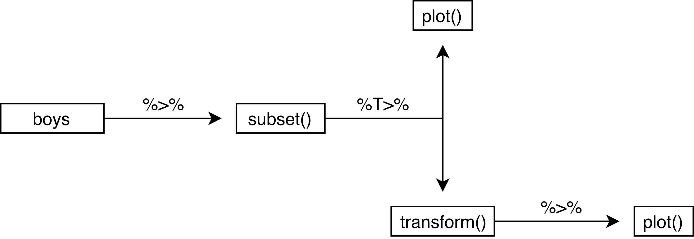

  
<style type="text/css">
  
body{ /* Normal  */
  font-size: 12px;
  }
td {  /* Table  */
  font-size: 12px;
}
h1.title {
  font-size: 18px;
  color: DarkBlue;
}
h1 { /* Header 1 */
  font-size: 18px;
}
h2 { /* Header 2 */
  font-size: 18px;
}
h3 { /* Header 3 */
  font-size: 18px;
}
code.r{ /* Code block */
  font-size: 12px;
}
pre { /* Code block - determines code spacing between lines */
  font-size: 14px;
}
</style>
```{r echo=FALSE}
printAnswers <- TRUE
```


---

# Exercises

These exercises yield a quick introduction of basic data wrangling, pipes and visualization in `R`. 

---

The following packages are required for this practical:
```{r, message=FALSE}
library(dplyr)    # For data wrangling
library(magrittr) # For pipes
library(mice)     # For the boys data
library(ggplot2)  # Plotting device
```
and if you'd like the same results as I have obtained, you can fix the random seed
```{r}
set.seed(123)
```

---

## Exercise 1

---

1. **Use a pipe to do the following:**

- draw 1000 values from a normal distribution with `mean = 5` and `sd = 1` - $N(5, 1)$, 
- create a matrix where the first 500 values are the first column and the second 500 values are the second column **
- make a scatterplot of these two columns
```{r}
rnorm(1000, 5) %>%
  matrix(ncol = 2) %>%
  plot()
```

---

## Exercise 2

---

2. **Use a pipe to calculate the correlation matrix on the `anscombe` data set**

```{r}
anscombe %>%
  cor()
```

---

## Exercise 3

---

3. **Now use a pipe to calculate the correlation for the pair (`x4`, `y4`) on the `anscombe` data set**

Using the standard `%>%` pipe:
```{r}
anscombe %>%
  subset(select = c(x4, y4)) %>%
  cor()
```
Alternatively, we can use the `%$%` pipe from package `magrittr` to make this process much more efficient.
```{r}
anscombe %$%
  cor(x4, y4)
```
The exposition pipe `%$%` *exposes* the listed dimensions (for a data frame these are the columns names) of the dataset. In the next step of the pipe we can then call on these named dimensions directly. 

---

## Exercise 4

---

4. **Use a pipe to calculate the correlation between `hgt` and `wgt` in the `boys` data set from package `mice`.**

Because `boys` has missings values for almost all variables, we must first select `wgt` and `hgt` and then omit the rows that have missing values, before we can calculate the correlation. Using the standard `%>%` pipe, this would look like:
```{r}
boys %>%
  subset(select = c("wgt", "hgt")) %>%
  cor(use = "pairwise.complete.obs")
```
which is equivalent to 
```{r}
boys %>%
  subset(select = c("wgt", "hgt")) %>%
  na.omit() %>%
  cor()
```
because we select only a pair of variables. In that case the listwise deletion from `na.omit()` would be equivalent to the pairwise deletion used by`cor()`.

Alternatively, we can use the `%$%` pipe:
```{r}
boys %$% 
  cor(hgt, wgt, use = "pairwise.complete.obs")
```
The `%$%` pipe *exposes* the listed dimensions of the `boys` dataset, such that we can refer to them directly. 

---

## Exercise 5

---

5. **Create a histogram for `age` in the `boys` data set**

With the standard plotting device in `R`:

```{r cache=TRUE}
boys %$%
  hist(age, breaks = 50)
```

The `breaks = 50` overrides the default breaks between the bars. By default the plot would be

```{r cache=TRUE}
boys %$%
  hist(age)
```
Using a pipe is a nice approach for this plot because it inherits the names of the objects we aim to plot. Without the pipe we might need to adjust the main title for the histogram:

```{r cache=TRUE}
hist(boys$age, breaks = 50)
```

With `ggplot2`:

```{r cache=TRUE}
boys %>%
  ggplot() + 
  geom_histogram(aes(age), binwidth = .4)
```

Please note that the plots from `geom_histogram()` and `hist` use different calculations for the bars (bins) and hence may look slightly different.

---

## Exercise 6

---

6. **Create a bar chart for `reg` in the boys data set**
With a standard plotting device in `R`:

```{r cache=TRUE}
boys %$%
  table(reg) %>%
  barplot()
```

With `ggplot2`:

```{r cache=TRUE}
boys %>%
  ggplot() + 
  geom_bar(aes(reg))
```

Note that `geom_bar` by default plots the `NA`'s, while `barplot()` omits the `NA`'s without warning. If we would not like to plot the `NA`s, then a simple `filter()` (see exercise 2) on the `boys` data is efficient. 

---

## Exercise 7

---

7. **Create a box plot for `hgt` with different boxes for `reg` in the `boys` data set**
With a standard plotting device in `R`:

```{r cache=TRUE}
boys %$%
  boxplot(hgt ~ reg)
```

With `ggplot2`:

```{r cache=TRUE}
boys %>%
  ggplot(aes(reg, hgt)) +
  geom_boxplot()
```


---

# Extra exercises

---

## Exercise 8

---

8. **In the `boys` data set, `hgt` is recorded in centimeters. Use a pipe to transform `hgt` in the `boys` dataset to height in meters and verify the transformation**

Using the standard `%>%` and the `%$%` pipes:
```{r}
boys %>%
  transform(hgt = hgt / 100) %$%
  mean(hgt, na.rm = TRUE)
```

---

## Exercise 9

---

9. **Use a pipe to plot the pair (`hgt`, `wgt`) two times: once for `hgt` in meters and once for `hgt` in centimeters. Make the points in the 'centimeter' plot `red` and in the 'meter' plot `blue`. **

This is best done with the `%T>%` pipe:
```{r}
boys %>%
  subset(select = c(hgt, wgt)) %T>%
  plot(col = "red", main = "Height in centimeters") %>%
  transform(hgt = hgt / 100) %>%
  plot(col = "blue", main = "Height in meters")
```

The `%T>%` pipe is very useful, because it creates a literal `T` junction in the pipe. It is perhaps most informative to graphically represent the above pipe as follows:
```{r eval=FALSE}
boys %>%
  subset(select = c(hgt, wgt)) %T>%
  plot(col = "red", main = "Height in centimeters") %>%
  transform(hgt = hgt / 100) %>%
  plot(col = "blue", main = "Height in meters")
```


We can see that there is indeed a literal T-junction. Naturally, we can expand this process with more `%T>%` pipes. However, once a pipe gets too long or too complicated, it is perhaps more useful to cut the piped problem into smaller, manageable pieces. 

---

## Exercise 10

---

10. **Create a density plot for `age` with different curves for boys from the `city` and boys from rural areas (`!city`).**
With a standard plotting device in `R`:

```{r cache=TRUE}
d1 <- boys %>%
  subset(reg == "city") %$%
  density(age)
d2 <- boys %>%
  subset(reg != "city") %$% 
  density(age)

plot(d1, col = "red", ylim = c(0, .08)) 
lines(d2, col = "blue") 

```

The above plot can also be generated without pipes, but results in an *ugly* main title. You may edit the title via the `main` argument in the `plot()` function.

```{r cache=TRUE}
plot(density(boys$age[!is.na(boys$reg) & boys$reg == "city"]), 
     col = "red", 
     ylim = c(0, .08))
lines(density(boys$age[!is.na(boys$reg) & boys$reg != "city"]), 
      col = "blue")
```

With `ggplot2` everything looks much nicer:

```{r cache=TRUE}
boys %>%
  mutate(area = ifelse(reg == "city", "city", "rural")) %>%
  filter(!is.na(area)) %>%
  ggplot(aes(age, fill = area)) +
  geom_density(alpha = .3) # some transparency
```

---

## Exercise 11

---

11. **Create a diverging bar chart for `hgt` in the `boys` data set, that displays for every `age` year that year's mean height in deviations from the overall average `hgt`**

Let's not make things too complicated and just focus on `ggplot2`:

```{r}
boys %>%
  mutate(Hgt = hgt - mean(hgt, na.rm = TRUE),
         Age = cut(age, 0:22, labels = 0:21)) %>%
  group_by(Age) %>%
  summarize(Hgt = mean(Hgt, na.rm = TRUE)) %>% 
  mutate(Diff = cut(Hgt, c(-Inf, 0, Inf),
                    labels = c("Below Average", "Above Average"))) %>%
  ggplot(aes(x = Age, y = Hgt, fill = Diff)) + 
  geom_bar(stat = "identity") +
  coord_flip()
```

We can clearly see that the average height in the group is reached just before age 7. 

The `group_by()` and `summarize()` function are advanced `dplyr` functions used to return the `mean()` of deviation `Hgt` for every group in `Age`. For example, if we would like the mean and sd of height `hgt` for every region `reg` in the `boys` data, we could call:

```{r}
boys %>%
  group_by(reg) %>% 
  summarize(mean_hgt = mean(hgt, na.rm = TRUE), 
            sd_hgt   = sd(hgt, na.rm = TRUE))
```

The `na.rm` argument ensures that the mean and sd of only the observed values in each category are used.

---

## Exercise 12

---

12. **Use a pipe to assign values `1:5` to object `x` and verify that the object exists.**

Normally, when we use the following code to assign values to an object, we can directly run the assign operator `<-` as
```{r, eval=FALSE}
x <- 1:5
```

However, when we would like to do this in a pipe, we need to run the `assign()` function. However, we then would run into the following problem. 
```{r, error=TRUE}
"x" %>% assign(1:5)
x
```

The pipe creates a separate, temporary environment where all things `%>%` take place (environments were discussed in Lecture C). This environment is different from the Global Environment and disappears once the pipe is finished. In other words, we assign `1:5` to object `x`, but once we are done assigning, object `x` is deleted. 

Function `assign()` is part of a class of functions that uses the current environment (the one that it is called from) to do its business. For such functions, we need to be explicit about the environment we would like the funtion to use:
```{r}
env <- environment()
"x" %>% assign(1:5, envir = env)
x
```
Now we have explicitly instructed function `assign()` to use the Global Environment:
```{r}
environment()
```

We could also create a new environment to assign values to objects
```{r}
assign.env <- new.env() 
"x" %>% assign(letters[1:5], envir = assign.env)
```
But then we need to call `x` from `assign.env`
```{r}
assign.env$x
```
because otherwise we would still get `x` from `R_GlobalEnv`
```{r}
x
```

Bottom line: Don't use the pipe to assign something to new objects!

---

End of Practical
 
---

#### Useful References

- [`magrittr`](https://magrittr.tidyverse.org)
- [`R` for Data Science](http://r4ds.had.co.nz) - [Chapter 18 on pipes](http://r4ds.had.co.nz/pipes.html)
- [The `ggplot2` reference page](https://ggplot2.tidyverse.org/reference/index.html)
