

---

In this exercise we focus on logistic regression. We use logistic regression when we would like to model a dichotomous response: an outcome variable that takes only two levels. The predictors can - as with linear regression - be continuous and/or categorical/dichotomous. 

---

# Default data

We start with the `Default` data set from the book [Introduction to Statitistical Learning](https://www.statlearning.com) by James, Witten, Hastie & Tibshirani (2021 - 2nd edition). The data set contains  information about `default` on creditcard payments for `students` and non-students, with for every respondent measurements on `income` and creditcard `balance`. 

---

_1_ **Download the data and load it in `JASP`**

The data can be [obtained here](Default.csv)

---

_2_ **Inspect the `Default` data set**

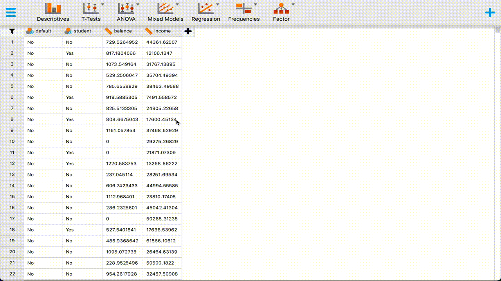{width=100%}
  
When we look at the output for the continuous variables, we find the following descriptive statistics:

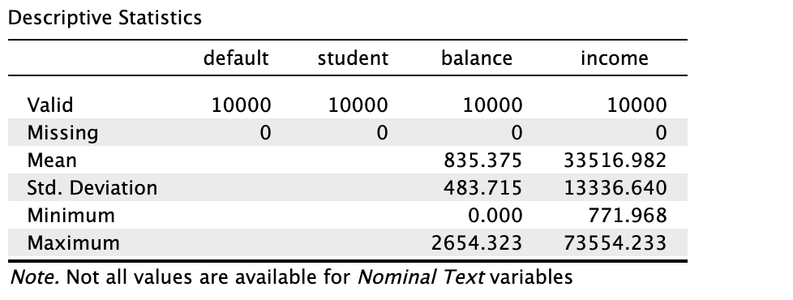{width=50%}
   We see that there are no missing values in the data. We also get information about the means and the standard deviation for `balance` and `income`. We get no information on these statistics for the categorical (in this case dichotomous) variables, as it would not make sense. 

The minimum and maximum values can be quickly inspected; these values can often be used to spot implausible or impossible values. For example, a negative income out of labour would not be possible. On the other hand, a negative credit card balance would be possible if someone were e.g. reimbursed on their card after a paymant had been made. In this case there are no negative `balance` or `income` values. 

The frequency distribution for `default` is as follows:

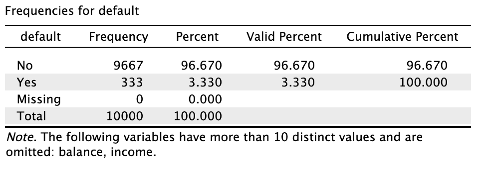{width=50%}
  We see that 9667 out of 10000 cases are not defaulting on their creditcard payment. That would be 96.67% of total cases. Because there are no missing values, the valid percentage is the same as the percentage. Cumulatively, these percentages sum up to 100%. One important fact: the data are quite imbalanced: very few cases are defaulting ont their credit card payment. This is an important fact, because if we would simply *predict* everyone to **not default on their credit card payment**, we would be 96.67% accurate. 

The `student` distribution is also imbalanced, but to a much less extreme extent. 

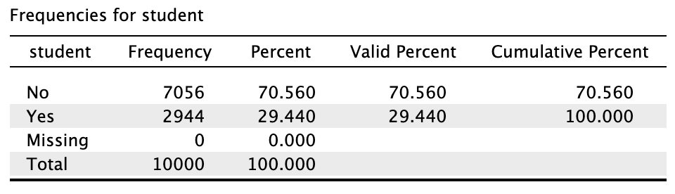{width=50%}
  2944 cases out of the 10000 observed are students. That is 29.44%. 

When we study the distribution plots we can identify the same information as in the tables. However, from the plots we can infer more information than from the tables alone. 

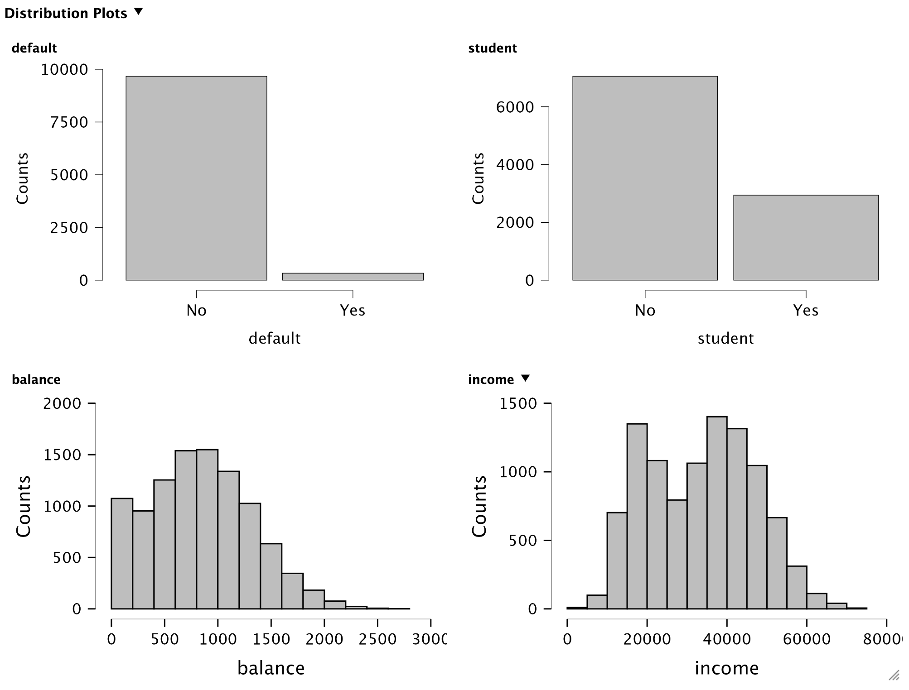{width=100%} 
   It is apparent that `student` is bimodal. One of the reasons for bimodality may be that there is a mixture of distributions for being a student or not being a student. When we study the correlation plots, this becomes very clear.

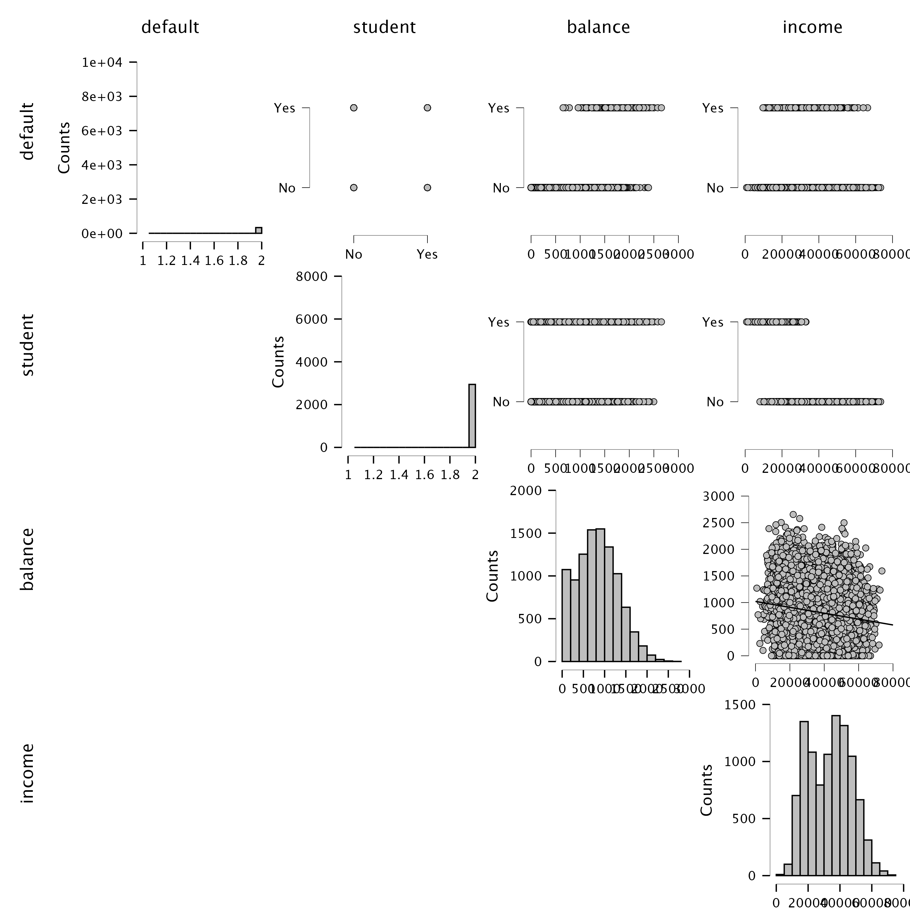{width=100%} 
   In the row `student` we can clearly see that there is a different distribution for `income`. That is, the distribution for `income` is less variable and has a lower mean for when `student` equals *Yes*. This of course makes sense: students generally have a lower income than non-students. Another feature that we see is that cases that `default` tend to have a higher `balance`. 

When we look at the boxplots, we see the same information as in the distribution plots, but now in terms of quartiles (each quart of the boxplot contains about 25% of cases) and the median *the bold line in the middle). The more symmetric a boxplot is, the more symmetric the data are distributed. 

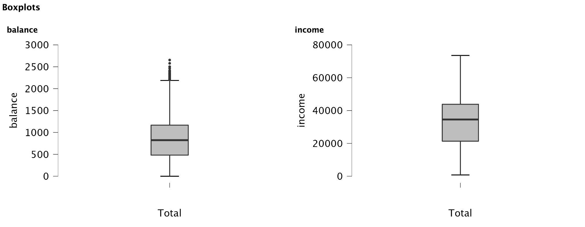{width=100%}

---

_3_ **Study the relation between `default`, `income` and `balance`. Can we use these variables to predict creditcard `default`?**

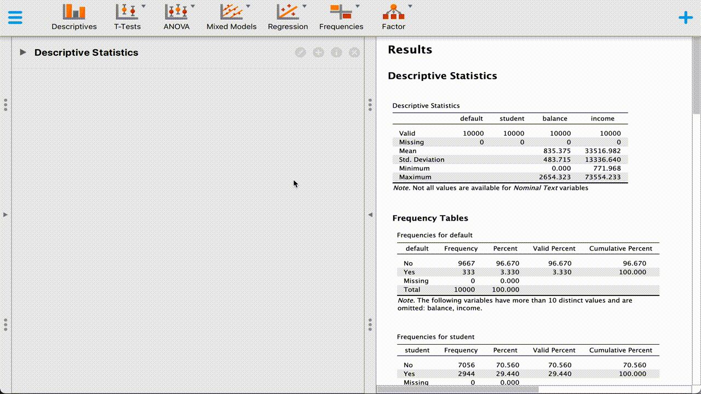{width=100%}
   Let's go through the output that we have generated. We start with the model summary:

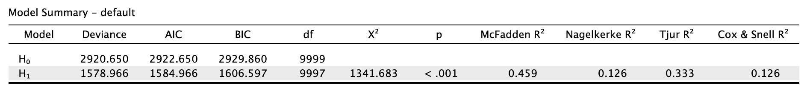{width=100%}

   We get output for two models. The first model is the null-model, i.e. a model with only an intercept as predictor. The second model adds the two predictors `balance` and `income`. We can see the two added parameters in the number of degrees of freedom (df). We also get the p-value for the studied model. This p-value corresponds to the test if the change in modeling is sufficient between the intercept only model $H_0$ and the studied model $H_1$. Since we don't use least-squares estimation, we have no residual sum of squares as with linear regression: we now have the *Deviance* as its counterpart for logistic regression. *AIC* and *BIC* are model fit statistics. These statistics work on the scale of the log-likelihood. Since the log of zero (no deviance) would be $\text{log}(0) = -\inf$. These statistics take fit and complexity into account. Lower values are therefore preferred. Our model has a lower AIC and BIC than the intercept-only model.

We also get 4 proxies for $R^2$ that work for logistic regression (the normal $R^2$ would be unreliable because of the dichotomous nature of the outcome `default`). 

The next output table gives us information on the coefficients with 95% confidence intervals. We see that the coefficients are very low, yet both coefficients are significant. We must realize that both the columns `balance` and `income` are measured in a large scale, hence the estimates are expected to be lower in size (imagine writing down 1 kilogram in grams or in metric tonnes - you'd have two completely different numbers because of the different scales). 

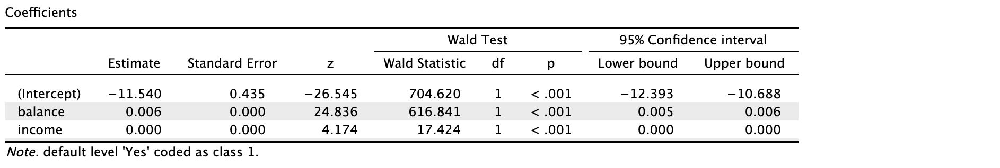{width=100%}
   The intercept denotes the estimate for the predicted outcome `default` when `balance` or `income` are zero. All estimates for the coefficients are logodds. The Wald statistic indicats the score on the Wald test that is used to determine statistical significance. The aim of the test it to determine if the estimate is equal to zero (that is its null hypothesis). All estimates are highly significant. 

The next output table that we asked for is the confusion matrix.

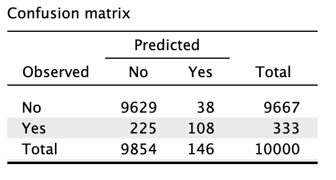{width=30%}
  A confusion matrix gives an indication about the performance of a logistic prediction effort. The diagonal would indicate cases being predicted conform the observed classification, i.e. `No` as `No` and `Yes` as `Yes`. The off-diagonal indicates errors. It is often useful to study the prediction matrix, as not every error may have the same cost. For example, in health care some prediction mistakes could cost lives while others may cost only money. 

The last piece of output that we requested contains the estimate plots.
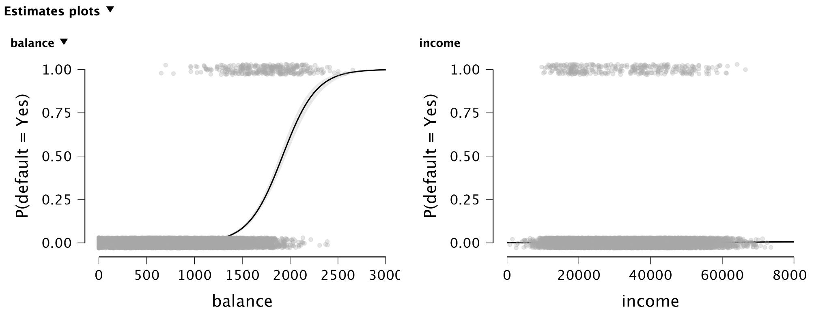{width=100%}
We can see a clear difference between `balance` and `income` in this estimation effort: the probability to default increases with `income`, but not as clearly as with `balance`. A higher credit card balance is related to a larger probability to default. The turning point for having a higher probability than $.50$ lies somewhere around a credit card balance of 2000.

---

_4_ **Now add `student` and study if there is a difference in the probability of creditcard fraud for students and non-students**

First, we can see that the Deviance has decreased, as have the AIC and BIC. That indicates an improvement in model fit. 

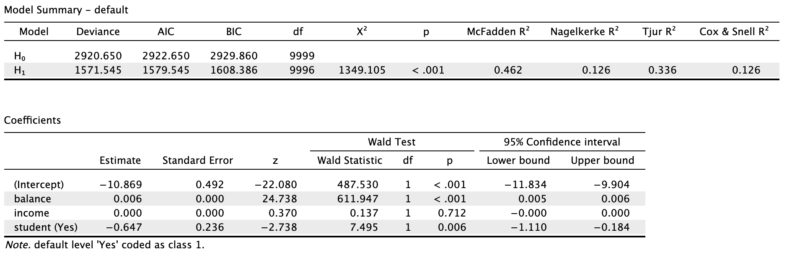{width=100%}
   From the coefficients table, we do see however that `income` is not a significant predictor anymore, when `student` is entered into the model. 

When studying the confusion matrix we see that the diagonal has decreased with respect to the previous model. So we have obtained a parametrically more sound model that makes more mistakes in predicting `default`. 

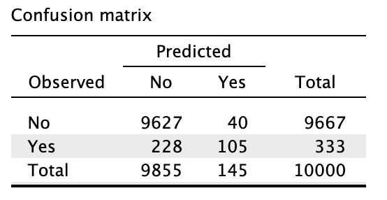{width=30%}

---

# Head Injury data
The `headInjury.csv` data frame has 3121 rows and 11 columns. The data were simulated according to a simple logistic regression model to match roughly the clinical characteristics of a sample of individuals who suffered minor head injuries.

_1_ **Download the data and load it in `JASP`**

The data can be [obtained here](headInjury.csv)

---

The head injury data set contains information on the following variables:

This data frame contains the following columns:

- `age.65`: age factor (0 = under 65, 1 = over 65).
- `amnesia.before`: amnesia before impact (less than 30 minutes = 0, more than 30 minutes =1).
- `basal.skull.fracture`: (0 = no fracture, 1 = fracture).
- `GCS.decrease`: Glasgow Coma Scale decrease (0 = no deterioration, 1 = deterioration).
- `GCS.13`: initial Glasgow Coma Scale (0 = not ‘13’, 1 = ‘13’).
- `GCS.15.2hours`: Glasgow Coma Scale after 2 hours (0 = not ‘15’, 1 = '15').
- `high.risk`: assessed by clinician as high risk for neurological intervention (0 = not high risk, 1 = high risk).
- `loss.of.consciousness`: (0 = conscious, 1 = loss of consciousness).
- `open.skull.fracture`: (0 = no fracture, 1 = fracture)
- `vomiting`: (0 = no vomiting, 1 = vomiting)
- `clinically.important.brain.injury`: any acute brain finding revealed on CT (0 = not present, 1 = present).

---

_2_ **Patients whose risk is sufficiently high will be sent for CT (computed tomography). Using a risk threshold of 0.025 (2.5%), turn the result into a decision rule for use of CT.**

This may seem as a more difficult question, but it is actually quite straigthforward. First we need to fit the logistic model where we predict `clinically.important.brain.injury` from the other variables. 

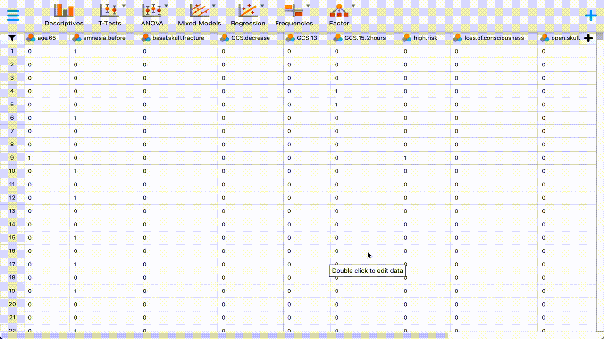{width=100%} 

A risk of 2.5% corresponds to the cutoff for a CT scan. This translates to a logit of $\log\left(\frac{.025}{1-.025}\right) = -3.663562$. In other words, any sum of variables that "lifts" the intercept above -3.66 would satisfy the cutoff. 

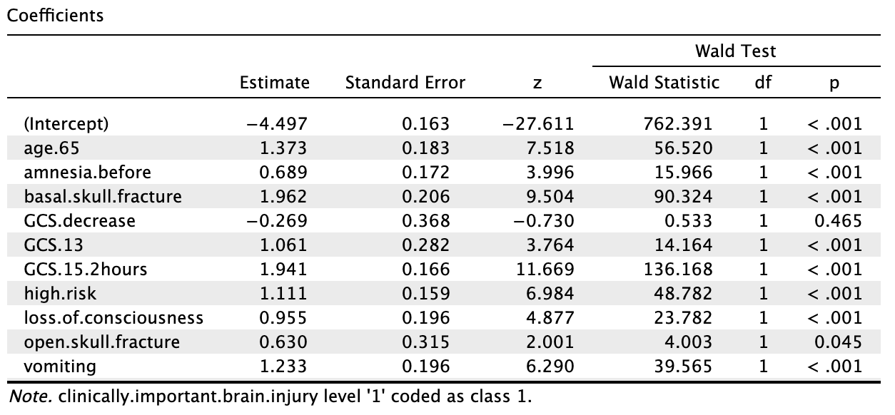{width=60%} 

   For example, being over 65 (`age.65`) would already warrant a CT scan, as would coming into the ER with a basal skull fracture (`basal.skull.fracture`). Alternatively, having an open skull fracture (`open.skull.fracture`) alone is not enough to warrant a CT scan. It needs to be acompanied by any of the other significant checks in order to satisfy the risk threshold. 

---

# Titanic data

The folks at JASP have a wonderful exercise on the Titanic data set. You can [find it here](https://jasp-stats.org/wp-content/uploads/2020/09/Cox_Snell.gif). The relevant data is included in JASP as a practice data set. 

There is [a video by Alexander Etz](https://www.youtube.com/watch?v=bUgpJeeReBY) that explains the output of the procedure very clearly. 

---

End of exercise