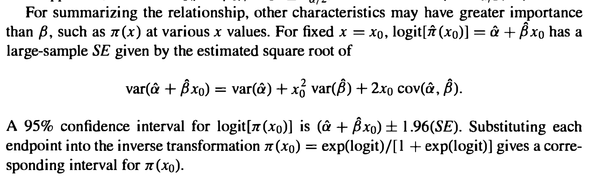

<style type="text/css">
  
body{ /* Normal  */
  font-size: 12px;
  }
td {  /* Table  */
  font-size: 12px;
}
h1.title {
  font-size: 18px;
  color: DarkBlue;
}
h1 { /* Header 1 */
  font-size: 18px;
}
h2 { /* Header 2 */
  font-size: 18px;
}
h3 { /* Header 3 */
  font-size: 18px;
}
code.r{ /* Code block */
  font-size: 12px;
}
pre { /* Code block - determines code spacing between lines */
  font-size: 14px;
}
</style>

---

The aim of this document is to highlight some workflows for generating confidence intervals and prediction intervals for individual values. I outline parametric and bootstrap approaches and demonstrate that these approaches are equivalent; at least for a sufficient number of bootstraps. 

---

# Load required packages
```{r}
library(tidyverse)
library(magrittr)
library(purrr)
library(ggplot2)
library(GGally)
library(ciTools)
library(caret)
library(marginaleffects)
library(insight)
set.seed(123)
```

---

# Grab the `titanic` data
We start with the titanic data set, that can be grabbed from my website. 
```{r warning=FALSE}
con <- url("https://www.gerkovink.com/erasmus/Day%202/Part%20D/titanic.csv")
titanic <- read_csv(con)
```

---

# Some data editing
I make sure that the categorical variables are correctly coded as factors, and I add a row indicator. We need this indicator later on, when we are using the bootstrap. Otherwise we cannot relate the bootstrapped estimates to the orginal cases. 
```{r}
titanic %<>% 
  mutate(Pclass = factor(Pclass, labels = c("1st class", "2nd class", "3rd class")), 
         Survived = factor(Survived, labels = c("No", "Yes")), 
         row = 1:887)
```

---

# Draw 10000 bootstrapped sets
I draw 10,000 bootstrapped samples out of the `titanic` set, where each sample is of the same length ($N=887$) and every row is randomly sampled with replacement. 
```{r}
boot <- replicate(n = 10000, 
                  expr = titanic[sample(nrow(titanic), 
                                        replace = TRUE), ], 
                  simplify = FALSE)
```
The `simplify = FALSE` statement is to keep the list structure in the object `boot`. I can then, later on, use this list structure to run my functional programming over. 

---

# Fit logistic model on true data set
This is the baseline model on the observed (not bootstrapped) data
```{r}
fit <- titanic %$% 
  glm(Survived ~ Pclass + Sex + Age, family = binomial(link = "logit"))
```

---

## Coefficients
Model `fit` has the following coefficients:
```{r}
fit %>% coef()
```

---

## Parameter CI's
Model `fit` has the following corresponding coefficients confidence intervals (95%):
```{r}
fit %>% confint
```

---

## Standard errors
The coefficient standard errors are:
```{r}
fit %>% summary %>% .$coefficients
```

---

# Fit logistic models on all bootstrap sets
Now we repeat the model fit on all bootstrapped sets. I use `purrr::map()` to fit the same generalized linear model on each listed dimension in `boot`, where every listed dimension contains a single bootstrapped sample from `titanic`.
```{r}
bootfit <- boot %>% 
  map(~.x %$% 
        glm(Survived ~ Pclass + Sex + Age, 
            family = binomial(link = "logit")))
```

---

## Bootstrapped Coefficients
The average bootstrapped coefficient are:
```{r}
bootcoef <- bootfit %>% 
  map(~.x %>% coef()) %>% 
  do.call("rbind", .) %>% 
  as_tibble()

bootcoef %>% colMeans()
ggpairs(bootcoef) 
```

---

## Bootstrapped CI's
The average bootstrapped percentile-based confidence intervals are:
```{r}
bootcoef %>% 
  sapply(., function(x) quantile(x, c(.025, .975))) %>% t()
```

---

## Bootstrapped SE's
The correponding bootstrapped standard errors across the bootstrapped parameters are :
```{r}
bootcoef %>% 
  sapply(., sd)
```

---

# Comparisons

I now compare the original parametrically obtained estimates to the estimates obtained via the bootstrap. 

---

## Coefficients
```{r}
data.frame(original = fit$coefficients, 
           bootstrap = bootcoef %>% colMeans())
```

---

## Confidence intervals
```{r}
list(original = fit %>% confint(), 
     bootstrap = bootcoef %>% 
       sapply(., function(x) quantile(x, c(.025, .975))) %>% t())
```

---

## Standard Errors
```{r}
data.frame(original = fit %>% summary %>% .$coefficients %>% .[, 2],
           bootstrap = bootcoef %>% 
  sapply(., sd))
```

We can see that the bootstrap is a valid approximation to the parameters and statistics obtained on the original data set.

---

# Individual intervals

Now let's calculate individual intervals via the bootstrap

---

## Bootstrap individual interval
The following codeblock calculates for every case in the `titanic` data the predicted value, the standard error of the predicted value and the corresponding row number. I combine these into a `tibble` with 3 columns: one for the rows, one for the predictions and one for the corresponding standard error. 
```{r}
# create matrix with size bootstrap \times cases
pred.matrix <- bootfit %>% 
  map(~.x %>% predict()) %>% 
  do.call("rbind", .) 

se.matrix <- bootfit %>% 
  map(~.x %>% predict(se = TRUE) %>% .$se.fit) %>% 
  do.call("rbind", .) 

rows.matrix <- boot %>% 
  map(~.x %>% .$row)  %>% 
  do.call("rbind", .) 

# row predictions
pred.data <- data.frame(rows = c(rows.matrix),
                        pred = c(pred.matrix),
                        se = c(se.matrix)) %>% 
  as_tibble()
```

Because the rows differ across the bootstrapped sets, I calculate the individual predictions and intervals over the corresponding row identifier. This means that on average, each row will be bootstrapped 10,000 times - but realized bootstrapped lengths may differ over the row numbers. 
```{r}
# calculate centroids and quantiles
pred <- pred.data %>% group_by(rows) %>% 
  summarize(est = mean(pred), 
            se.fit = mean(se),
            lwr = est - 1.96 * se.fit, #parametric SE
            upr = est + 1.96 * se.fit, #parametric SE
            lwr.q = quantile(pred, .025), 
            upr.q = quantile(pred, .975))

# convert to prob
pred %<>% mutate(prob = plogis(est),
                 plwr = plogis(lwr),
                 pupr = plogis(upr),
                 plwr.q = plogis(lwr.q),
                 pupr.q = plogis(upr.q))

# head of predictions calculated
pred
```

---

## Compare predictions
If we compare the predicted values obtained on the original data to the predicted values obtained via the bootstrap in a Q-Q plot, we find that their distribution is very close. Increasing the number of bootstraps will bring them closer. 
```{r}
plot(x = fit %>% predict, 
     y = pred$est, 
     xlab = "fitted predictions",
     ylab = "bootstrapped predictions")
```

## Compare se's
The same holds for the estimated standard errors. 
```{r}
y_se <- fit %>% 
  predict(se = TRUE) %>% 
  as.data.frame()
plot(x = y_se$se.fit, 
     y = pred$se.fit, 
     xlab = "fitted standard errors",
     ylab = "bootstrapped fitted standard errors")
```

---

## Individual interval true model 
```{r}
fit %>% 
  predict(se = TRUE) %>% 
  as.data.frame() %>% 
  mutate(prob = plogis(fit),
         lwr = plogis(fit - 1.96 * se.fit),
         upr = plogis(fit + 1.96 * se.fit)) %>% 
  ggplot(aes(x = fit, y = prob)) + 
  geom_ribbon(aes(ymin = lwr, ymax = upr), alpha = .2) +
  geom_line(lwd = 1) + ylab("Probability of Survival") + xlab("Logodds of Survival") + ggtitle("Interval based on the true data estimates") + theme_classic()
```

---

## Individual interval bootstrapped se
```{r}
pred %>% 
  ggplot(aes(x = est, y = prob)) + 
  geom_ribbon(aes(ymin = plwr, ymax = pupr), alpha = .2) +
  geom_line(lwd = 1) + ylab("Probability of Survival") + xlab("Logodds of Survival") + ggtitle("Interval based on bootstrapped SE") + theme_classic()
```

---

## Individual interval bootstrapped quantile
```{r}
pred %>% 
  ggplot(aes(x = est, y = prob)) + 
  geom_ribbon(aes(ymin = plwr.q, ymax = pupr.q), alpha = .2) +
  geom_line(lwd = 1) + ylab("Probability of Survival") + xlab("Logodds of Survival") + ggtitle("Interval based on bootstrapped quantiles") + theme_classic()
```

---

# Confusion Matrices

---

## Original data predictions (reference = truth)
```{r}
yhat <- fit %>% 
  predict(type = "response") 

yhat <- ifelse(yhat > .5, "Yes", "No") %>%  # easy threshold for brevity
  as.factor()

confusionMatrix(yhat, titanic$Survived)
```


---

## Bootstrapped predictions (reference = truth)
```{r}
predicted <- ifelse(pred$prob > .5, "Yes", "No") %>% 
  as.factor()

confusionMatrix(predicted, titanic$Survived)
```

---

## Bootstrapped vs original data predictions (reference = bootstrap)
```{r}
confusionMatrix(yhat, predicted) # bootstrap is reference
```


# Checks

## Check the individual`se.fit`
Let's identify if we can replicate the `se.fit` calculation. First, lets manually calculate the `se.fit` that is produced by `predict()`. 
```{r}
# For the whole data
pred <- predict(fit, se = TRUE)
X <- model.matrix(fit) # Design matrix
sefun <- function(x) sqrt(t(x) %*% vcov(fit) %*% x)
SE.manual <- apply(X, 1, sefun)
all.equal(pred$se.fit,SE.manual) # SAME
```
That works. 

## Is this the same as the interval stated in e.g. the book by Agresti?
[Agresti](https://www.wiley.com/en-gb/Categorical+Data+Analysis%2C+3rd+Edition-p-9780470463635) (pp. 170) states:


Let's find out:
```{r}
#Let's take a simple model for reasons of simplicity. 
fit1 <- titanic %$% 
  glm(Survived ~ Age, family = binomial(link = "logit"))
vcov(fit1)

# using predict()
predict(fit1, newdata = data.frame(Age = 22), se.fit = TRUE)

# cf. Agresti pp 170-171
sqrt(0.0254382353 + 22^2 * 2.447639e-05 + 2*22 * -0.0007111544)

## THOSE ARE IDENTICAL!
```
YES, both estimates are identical. Agresti yields the same estimated standard error of individual fit as `predict()`.

Some additional checks across packages.
```{r}
predict(fit, se.fit = TRUE) %>%  
  as.data.frame() %>% 
  mutate(prob = plogis(fit), 
         lwr = plogis(fit - qt(.975, Inf) * se.fit),
         upr = plogis(fit + qt(.975, Inf) * se.fit)) %>% head()

# from package insight
get_predicted_ci(fit, 
                 predictions = get_predicted(fit), 
                 ci_type = "prediction") %>% 
  head()
```


## Are prediction intervals wider than confidence intervals
Of course they are. Some proof for a linear model:
```{r}
fit0 <- lm(hgt ~ age, data = mice::boys)

# confidence interval
predict(fit0, interval = "confidence") %>% head()

# prediction interval
predict(fit0, interval = "prediction") %>% head()
```
Note that the warning states that the predictions refer to future responses. Hence, the larger variance and wider intervals. 

