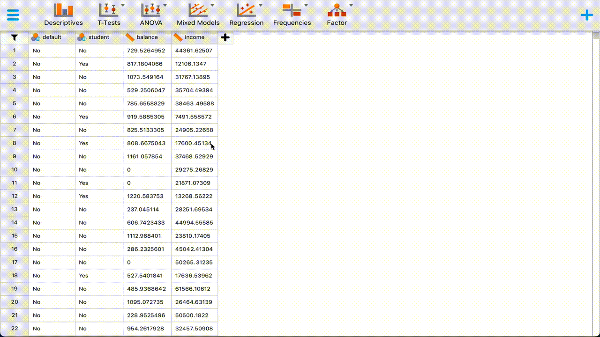
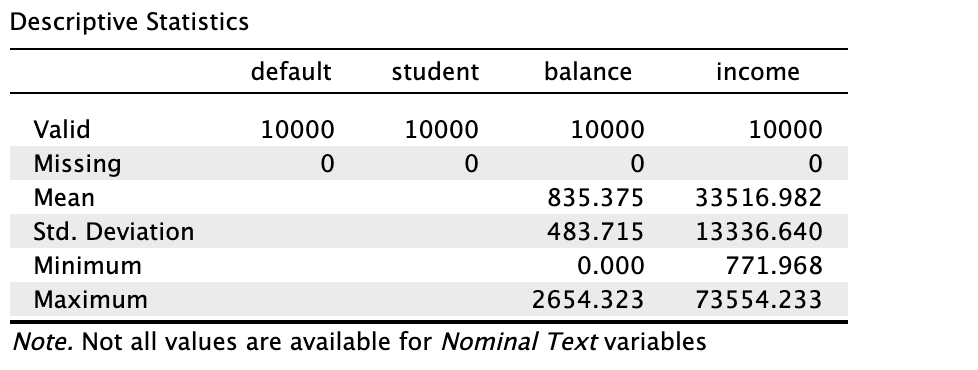
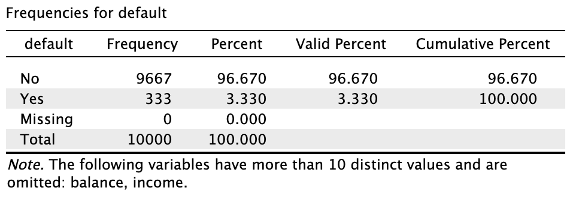
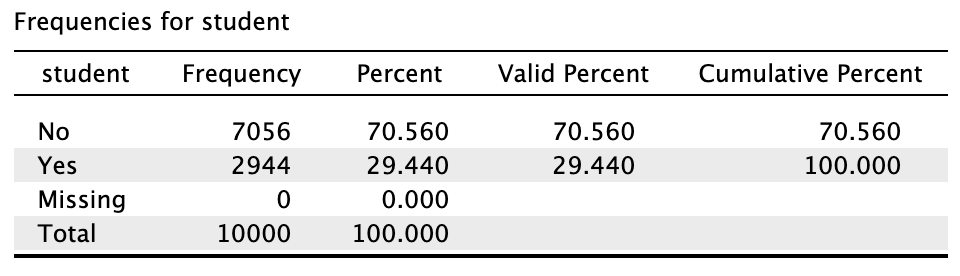
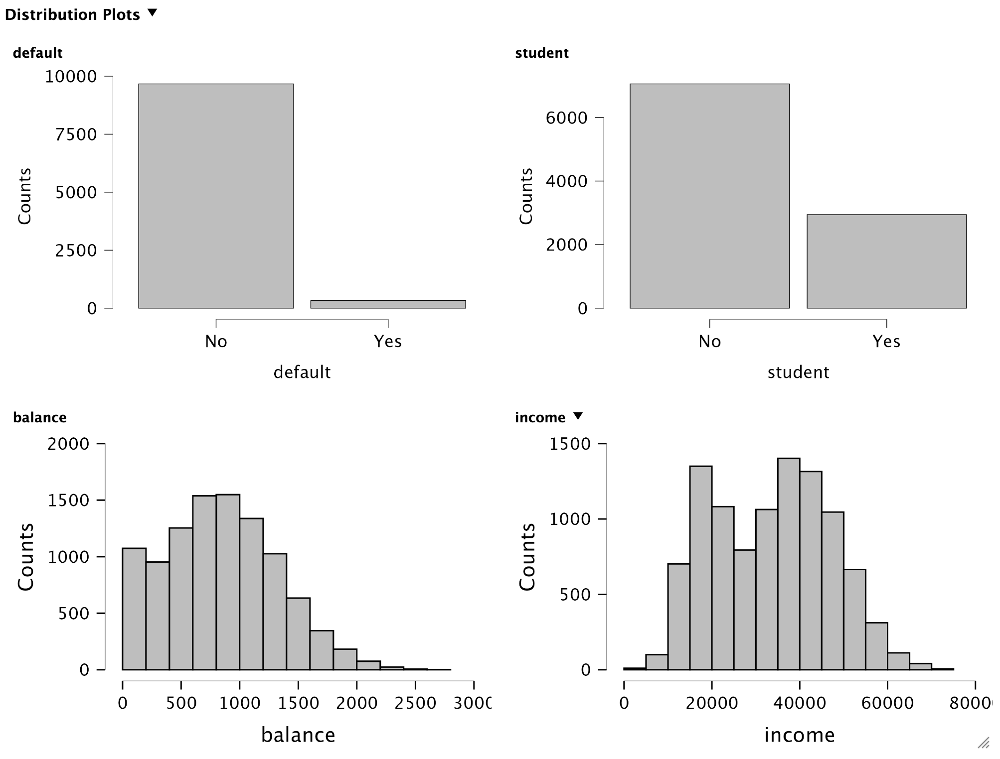
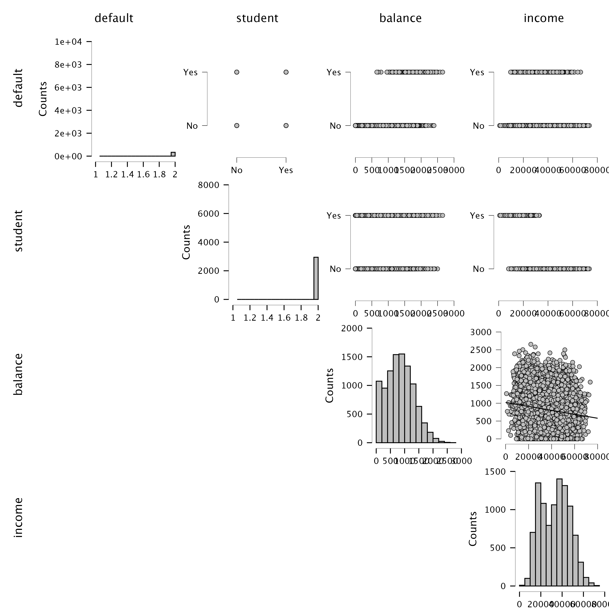
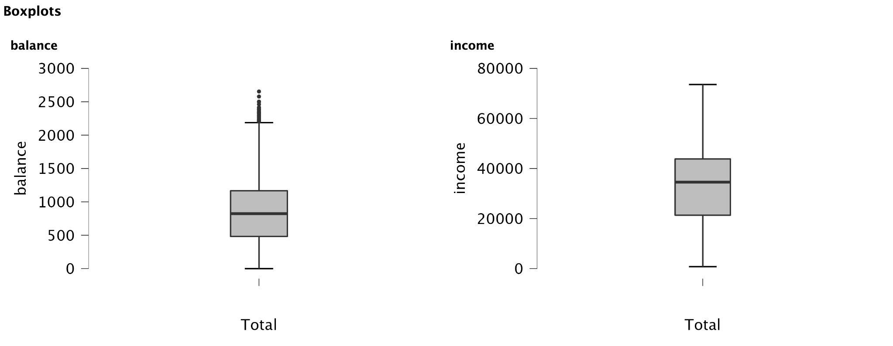
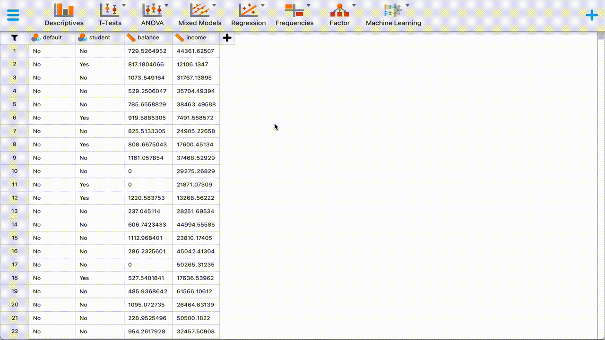

---

In this exercise we focus on classification. We use classification algorithms to classify an outcome based on a predictor space. The predictors can - as with linear or logistic regression - be continuous and/or categorical/dichotomous. The outcome is assumed to be categorical so that it can be classified. 

---

# Machine learning in JASP

There is a module focused on machine learning in `JASP`. The module is not by default activated, but can easily added to the standard menu bar by clicking the *plus* symbol in the top right of the `JASP` pane. The folks at `JASP` have created a wonderful tutorial that details how to activate the `JASP` module and how to train a machine learning module. 

---

_1_ **Study [this tutorial](https://jasp-stats.org/2019/10/07/how-to-train-a-machine-learning-model-in-jasp-classification/) about training machine learning models in `JASP`. **

---

# Default data

We continue with the `Default` data set from the book [Introduction to Statistical Learning](https://www.statlearning.com) by James, Witten, Hastie & Tibshirani (2021 - 2nd edition). We also used this data set in the previous `JASP` exercise for week 2. The data set contains  information about `default` on creditcard payments for `students` and non-students, with for every respondent measurements on `income` and creditcard `balance`. 

The data can be [obtained here](https://www.gerkovink.com/datasets/Default.csv)

---

_2_ **Open the file and inspect the `Default` data set**

{width=100%}
  
When we look at the output for the continuous variables, we find the following descriptive statistics:

{width=50%}
   We see that there are no missing values in the data. We also get information about the means and the standard deviation for `balance` and `income`. We get no information on these statistics for the categorical (in this case dichotomous) variables, as it would not make sense. 

The minimum and maximum values can be quickly inspected; these values can often be used to spot implausible or impossible values. For example, a negative income out of labour would not be possible. On the other hand, a negative credit card balance would be possible if someone were e.g. reimbursed on their card after a paymant had been made. In this case there are no negative `balance` or `income` values. 

The frequency distribution for `default` is as follows:

{width=50%}
  We see that 9667 out of 10000 cases are not defaulting on their creditcard payment. That would be 96.67% of total cases. Because there are no missing values, the valid percentage is the same as the percentage. Cumulatively, these percentages sum up to 100%. One important fact: the data are quite imbalanced: very few cases are defaulting ont their credit card payment. This is an important fact, because if we would simply *predict* everyone to **not default on their credit card payment**, we would be 96.67% accurate. 

The `student` distribution is also imbalanced, but to a much less extreme extent. 

{width=50%}
  2944 cases out of the 10000 observed are students. That is 29.44%. 

When we study the distribution plots we can identify the same information as in the tables. However, from the plots we can infer more information than from the tables alone. 

{width=100%} 
   It is apparent that `student` is bimodal. One of the reasons for bimodality may be that there is a mixture of distributions for being a student or not being a student. When we study the correlation plots, this becomes very clear.

{width=100%} 
   In the row `student` we can clearly see that there is a different distribution for `income`. That is, the distribution for `income` is less variable and has a lower mean for when `student` equals *Yes*. This of course makes sense: students generally have a lower income than non-students. Another feature that we see is that cases that `default` tend to have a higher `balance`. 

When we look at the boxplots, we see the same information as in the distribution plots, but now in terms of quartiles (each quart of the boxplot contains about 25% of cases) and the median *the bold line in the middle). The more symmetric a boxplot is, the more symmetric the data are distributed. 

{width=100%}

---

## K-nearest neighbours

---

_3_ **Use the machine learning module to fit a K-nearest neighbours classification model with `Default` as the outcome and the other features as the predictors. Set the seed value to `123`.**

{width=100%}

---

## Random Forest

---

_4_ **Now use the machine learning module to fit a Random Forest classification model with `Default` as the outcome and the other features as the predictors. Use the same seed value**

---

Try to make sense of the output by yourself. You can use the slides and corresponding references that Daniel provided, or any source for that matter. I will add [a video discussion of the corresponding output files](https://www.dropbox.com/s/6xyn000mw49w890/jasp-recording.mp4?dl=0) to the course page on Wednesday March 23. 

---

End of exercises
