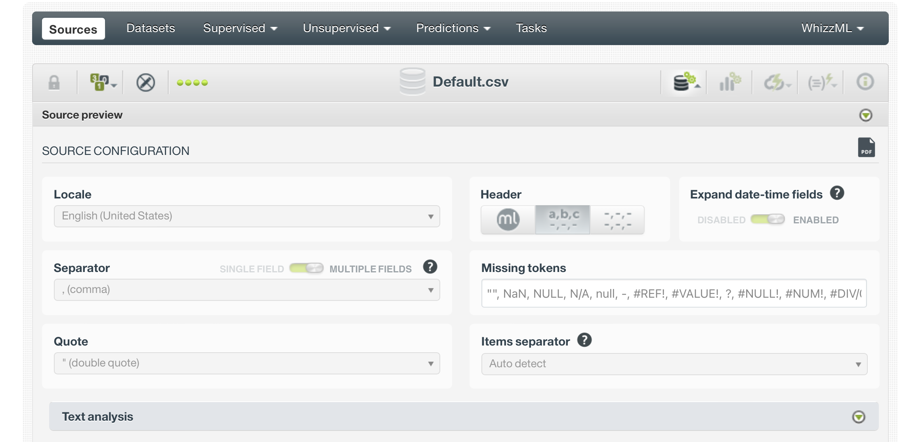

---

In this exercise we focus on classification. We use classification algorithms to classify an outcome based on a predictor space. The predictors can - as with linear or logistic regression - be continuous and/or categorical/dichotomous. The outcome is assumed to be categorical so that it can be classified. 

---

# Machine learning in BigML

---

_1_ **Study [training.bigml.com](http://training.bigml.com) about training machine learning models in `BigML`.**

---

## Default data
We continue with the `Default` data set from the book Introduction to Statistical Learning by James, Witten, Hastie & Tibshirani (2021 - 2nd edition). We also used this data set in the previous exercise for week 2. The data set contains information about default on creditcard payments for students and non-students, with for every respondent measurements on income and creditcard balance.
The data can be [obtained here](https://www.gerkovink.com/datasets/Default.csv).

---

_2_ **Upload the file and inspect the `Default` data set**

The complete workflow process is outlined in the below image sequence. 

{width=100%}

A step-by-step image walkthrough follows below:

{width=100%}
Check the locale and adjust to English if appropriate

{width=100%}

---

_3_ **Create a dataset**

When we look at the output for the continuous variables, we find the following descriptive statistics:

{width=100%}
We see that there are no missing values in the data. We also get information about the means and the standard deviation for balance and income. We get no information on these statistics for the categorical (in this case dichotomous) variables, as it would not make sense.
The minimum and maximum values can be quickly inspected; these values can often be used to spot implausible or impossible values. For example, a negative income out of labour would not be possible. On the other hand, a negative credit card balance would be possible if someone were e.g. reimbursed on their card after a paymant had been made. In this case there are no negative balance or income values.

The frequency distribution for default is as follows:

{width=100%}
We see that 9667 out of 10000 cases are not defaulting on their creditcard payment. That would be 96.67% of total cases. Because there are no missing values, the valid percentage is the same as the percentage. Cumulatively, these percentages sum up to 100%. One important fact: the data are quite imbalanced: very few cases are defaulting ont their credit card payment. This is an important fact, because if we would simply predict everyone to not default on their credit card payment, we would be 96.67% accurate.

The `student` distribution is also imbalanced, but to a much less extreme extent.

{width=100%}

2944 cases out of the 10000 observed are students. That is 29.44%. In other words, 70.56% of cases are not students. 

When we study the distribution plots we can identify the same information as in the tables. However, from the plots we can infer more information than from the tables alone.

{width=100%}
It is apparent that student is bimodal. One of the reasons for bimodality may be that there is a mixture of distributions for being a student or not being a student. When we study the correlation plots, this becomes very clear.
You can make scatterplots for all dimensions

{width=100%}
{width=100%}

In the row student we can clearly see that there is a different distribution for income. That is, the distribution for income is less variable and has a lower mean for when student equals Yes. This of course makes sense: students generally have a lower income than non-students. Another feature that we see is that cases that default tend to have a higher balance.

---

## K-Means and prediction based upon the clusters 

_4_ **Use the machine learning module to fit a K-means clustering model with Default as the outcome and the other features as the predictors.**

{width=100%}
Add the cluster to the dataset and the distance to the dataset and then train a model to predict the Default.(first make a 80/20 or 70/30 split)

{width=100%}

{width=100%}

---

## Random Forest

---

_5_ **Now use the the supervised learning module to fit a Random Forest classification model with Default as the outcome and the other features as the predictors.** 

First, when we run the random forest we obtain the following output 
{width=100%}

The random forest model results in the corresponding confusion matrix:

{width=100%}
With the following ROC curve

{width=100%}

And model feature importances:

{width=100%}
When you make an predicting using above model and input your data you get an explanation of the decision based upon Shap values.

{width=100%}

You can also consider using OptiML or even autoML to generate the optimal models.

---

End of exercises

